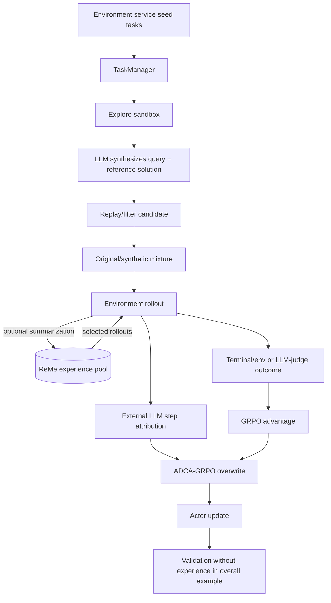

# Case study: `modelscope/AgentEvolver`

- **Status:** Complete
- **Study date:** 2026-07-28
- **Source:** [`modelscope/AgentEvolver`](https://github.com/modelscope/AgentEvolver)
- **Pinned commit:** [`a5a8db8689d6493b028107dcb4c27415441581dc`](https://github.com/modelscope/AgentEvolver/tree/a5a8db8689d6493b028107dcb4c27415441581dc)
- **Commit date:** 2026-03-28
- **Paper:** [arXiv `2511.10395v1`](https://arxiv.org/abs/2511.10395v1)
- **Source license:** [Apache-2.0](https://github.com/modelscope/AgentEvolver/blob/a5a8db8689d6493b028107dcb4c27415441581dc/LICENSE)
- **Related design:** [Hermes-style experiential-learning MVP](../../specs/0001-hermes-style-experiential-learning-mvp.md); [hypothetical extensions](../../hypothetical-extensions/specs/README.md)

## Executive verdict

AgentEvolver is a substantial research implementation of **weight-level agent improvement**. It generates synthetic environment tasks, optionally injects retrieved experience into selected rollouts, asks external LLMs to grade whole trajectories and intermediate steps, computes GRPO-style advantages, and updates a Qwen policy through distributed PPO. Its three named mechanisms are not merely diagrams: all three have concrete source and enter the trainer's principal path when their configuration gates are enabled.

That does **not** make it an implementation of the problem Claude Self-Improvement is solving. AgentEvolver changes model parameters on an eight-GPU RL stack. Claude Self-Improvement cannot update Claude weights; it persists reviewed facts, instructions, and procedures into Claude-readable artifacts. AgentEvolver's portable contribution is therefore its decomposition of an improvement loop—not its trainer, reward algebra, Ray topology, or API-specific infrastructure.

The strongest portable ideas are:

1. separate task/candidate generation, experience reuse, credit assignment, and evaluation;
2. preserve both untreated and experience-guided samples within a group rather than replacing all exploration with retrieval;
3. evaluate without experience injection to test whether behavior was internalized;
4. use outcome signals to anchor model-generated process judgments;
5. make generated-objective provenance, grader type, grouping identity, and step boundaries explicit data; and
6. inspect improvement as a dataflow with observable intermediate artifacts.

The most important cautions are equally concrete:

- reported benchmark gains are paper results, not results reproduced in this audit;
- there are no tags, releases, GitHub Actions workflows, packaged checkpoints, or end-to-end reproducibility harness at the pinned revision;
- the complete test collection aborts in a minimally provisioned environment because a test module calls `sys.exit(1)` when an optional dependency is absent;
- task and reward quality depend on external LLM judges, generated reference solutions, and several HTTP services;
- no committed canary test proves reference solutions remain outside actor-visible or later training-visible text;
- full prompts, trajectories, judge inputs, judge outputs, tasks, and observations can be written to disk;
- a credential-shaped W&B value and a private-looking HTTP endpoint are hard-coded in the Ray runtime environment; and
- the source is research code with TODOs, incomplete interfaces, broad exception fallbacks, and limited tests around the core training math.

**Recommendation:** adopt the loop decomposition, explicit provenance fields, paired retrieval/no-retrieval sampling, held-out evaluation, and outcome-anchored critique. Adapt them into bounded candidate review and deterministic artifact validation. Reject direct transplantation of distributed RL, generated-reference LLM judging as authorization, raw trajectory retention, external memory services, and automatic policy mutation. Claude Self-Improvement should keep its proposed review-first, least-authority, journaled, reversible local design.

## Scope and evidence standard

This study:

1. cloned and detached the upstream source at the pinned commit;
2. inspected the README, paper, configuration composition, launcher, trainer, environment path, task manager, experience manager, context managers, ADCA-GRPO implementation, graders, tests, install path, dependencies, Git history, repository metadata, issues, and license;
3. traced each headline mechanism into—or out of—the actual trainer loop;
4. ran safe syntax, configuration, and small offline test checks without credentials, model downloads, GPUs, services, or training; and
5. compared the observed system with Spec-0001's context-level, review-gated design.

Evidence labels used below:

- **Implemented:** source is connected to the principal executable path.
- **Configuration-gated:** implemented, but inactive unless configuration enables it.
- **Author-reported:** stated in the README or paper; not independently reproduced here.
- **Not demonstrated:** source or evidence needed to establish the stronger claim is absent.

No environment service, ReMe service, model API, Ray cluster, model checkpoint, or GPU training job was started. No benchmark result was reproduced. Absence of that expensive experiment is reported as a verification boundary, not filled with inferred results.

## Source reality

At the pinned commit, the local checkout contains:

| Surface | Observed value |
| --- | ---: |
| Tracked files | 381 |
| Reachable commits | 858 |
| Python files | 202 |
| Python lines, including blanks/comments | 40,593 |
| Test-like Python files | 16 |
| `test_*` function definitions found | 29 |
| GitHub Actions workflows | 0 |
| Git tags | 0 |
| GitHub releases | 0 |
| Git submodules | 2: AgentScope and veRL |

The history begins in June 2025, is concentrated between June and December 2025, and has only a small number of 2026 commits before the pinned March 2026 revision. The README calls the November 2025 state “v1,” but the repository has no corresponding Git tag or GitHub release ([README lines 27–34](https://github.com/modelscope/AgentEvolver/blob/a5a8db8689d6493b028107dcb4c27415441581dc/README.md#L27-L34)). “Released” here means publicly pushed source, not a versioned release artifact.

The root is not a conventional installable Python package: there is no `pyproject.toml` or `setup.py` at the pinned commit. The supported path creates a Conda environment, installs CUDA, installs a 210-line pinned requirements snapshot, and then installs FlashAttention plus an unpinned `ring-flash-attn` ([`install.sh`](https://github.com/modelscope/AgentEvolver/blob/a5a8db8689d6493b028107dcb4c27415441581dc/install.sh)). The requirements include a commit-pinned veRL URL routed through a third-party Git proxy, while the repository also carries veRL as a submodule. This is enough to describe a research environment, but not a hash-locked, hermetic, or release-tested supply chain.

## What AgentEvolver actually improves

AgentEvolver's durable improvement is a changed policy checkpoint:

```text
environment tasks / generated tasks
             |
             v
     multi-turn rollouts
             |
     +-------+--------+
     |                |
terminal or       LLM step
LLM-judge reward  attribution
     |                |
     +-------+--------+
             v
       advantages
             |
             v
  PPO/GRPO actor update
             |
             v
    new model weights
```

The trainer constructs Ray worker groups, a policy/reference/critic topology, task managers, reward managers, and then calls `trainer.fit()` ([`main_ppo.py` lines 215–336](https://github.com/modelscope/AgentEvolver/blob/a5a8db8689d6493b028107dcb4c27415441581dc/agentevolver/main_ppo.py#L215-L336)). The fit loop generates environment trajectories, computes rewards and log probabilities, computes GRPO advantages, optionally overwrites them with ADCA-GRPO advantages, and updates the actor ([`ae_ray_trainer.py` lines 1196–1335](https://github.com/modelscope/AgentEvolver/blob/a5a8db8689d6493b028107dcb4c27415441581dc/agentevolver/module/trainer/ae_ray_trainer.py#L1196-L1335)).

This differs categorically from Claude Self-Improvement:

| Dimension | AgentEvolver | Claude Self-Improvement |
| --- | --- | --- |
| Improvement target | Qwen policy parameters | Claude-readable local knowledge artifacts |
| Mutation | Gradient update/checkpoint | Reviewed filesystem change |
| Primary evidence | Environment or LLM reward | Verified correction, successful method, or explicit request |
| Unit of reuse | Weights plus external experience pool | Fact, instruction, rule, or skill |
| Authorization | Training configuration | Deterministic policy plus user approval |
| Rollback | Model checkpoint discipline, not implemented as a general content journal | Required journal, preimage, validation, and rollback |
| Compute boundary | Ray, vLLM, veRL, CUDA, multi-GPU | Small local CLI and Claude plugin |

Calling both systems “self-improvement” must not erase this distinction.

## End-to-end implemented dataflow



### 1. Self-questioning: environment to synthetic tasks

The task manager is implemented, not just documented:

- it loads seed task identifiers from the environment service ([`task_manager.py` lines 136–157](https://github.com/modelscope/AgentEvolver/blob/a5a8db8689d6493b028107dcb4c27415441581dc/agentevolver/module/task_manager/task_manager.py#L136-L157));
- repeats each seed task `n` times, explores in a thread pool, summarizes trajectories into `TaskObjective` records, checkpoint-saves partial output, filters it, and shuffles the result ([lines 191–283](https://github.com/modelscope/AgentEvolver/blob/a5a8db8689d6493b028107dcb4c27415441581dc/agentevolver/module/task_manager/task_manager.py#L191-L283));
- stores a synthetic natural-language query and generated ground truth in the task schema ([`schema/task.py` lines 18–31](https://github.com/modelscope/AgentEvolver/blob/a5a8db8689d6493b028107dcb4c27415441581dc/agentevolver/schema/task.py#L18-L31));
- replays candidates using a solver prompt that deliberately includes the generated solution as a tip, then uses another LLM to decide success and rewrite the ground truth ([`llm_filter.py` lines 137–215](https://github.com/modelscope/AgentEvolver/blob/a5a8db8689d6493b028107dcb4c27415441581dc/agentevolver/module/task_manager/filters/llm_filter.py#L137-L215) and [431–439](https://github.com/modelscope/AgentEvolver/blob/a5a8db8689d6493b028107dcb4c27415441581dc/agentevolver/module/task_manager/filters/llm_filter.py#L431-L439)); and
- converts accepted objectives into RL records with evaluator and ground-truth metadata ([`adapter.py` lines 35–73](https://github.com/modelscope/AgentEvolver/blob/a5a8db8689d6493b028107dcb4c27415441581dc/agentevolver/module/task_manager/adapter.py#L35-L73)).

`FullDataset` generates or loads synthetic objectives only when its mixture strategy requests them, then builds the training dataset ([`task_manager.py` lines 348–410](https://github.com/modelscope/AgentEvolver/blob/a5a8db8689d6493b028107dcb4c27415441581dc/agentevolver/module/task_manager/task_manager.py#L348-L410)). The full shell example explicitly selects synthetic-only data with a very large ratio and disables original tasks ([`run_overall.sh` lines 112–119](https://github.com/modelscope/AgentEvolver/blob/a5a8db8689d6493b028107dcb4c27415441581dc/examples/run_overall.sh#L112-L119)).

**Assessment:** implemented and trainer-integrated. “Eliminating costly manual dataset construction” is too broad: operators still provide environment adapters, profiles, preferences, seed task access, grader prompts, model services, and curation parameters. The generated dataset replaces some task authoring, not all human specification.

### 2. Self-navigating: experience-guided rollouts

The experience path is also real and configuration-gated:

- `ExperienceManager` divides each task's rollouts into experience and no-experience conditions according to a configured ratio ([`exp_manager.py` lines 167–212](https://github.com/modelscope/AgentEvolver/blob/a5a8db8689d6493b028107dcb4c27415441581dc/agentevolver/module/exp_manager/exp_manager.py#L167-L212));
- `ExperienceWorker` queries a ReMe context-generator service and prepends retrieved text to the task query ([lines 217–274](https://github.com/modelscope/AgentEvolver/blob/a5a8db8689d6493b028107dcb4c27415441581dc/agentevolver/module/exp_manager/exp_manager.py#L217-L274));
- `AgentFlow.execute` calls that worker before the rollout and records experience metadata ([`agent_flow.py` lines 44–81](https://github.com/modelscope/AgentEvolver/blob/a5a8db8689d6493b028107dcb4c27415441581dc/agentevolver/module/agent_flow/agent_flow.py#L44-L81));
- selected experience text can be removed from the trainable context while an `exp_mask` marks tokens for modified clipping behavior ([`cmt_linear.py` lines 586–598](https://github.com/modelscope/AgentEvolver/blob/a5a8db8689d6493b028107dcb4c27415441581dc/agentevolver/module/context_manager/cmt_linear.py#L586-L598), [`env_manager.py` lines 561–567](https://github.com/modelscope/AgentEvolver/blob/a5a8db8689d6493b028107dcb4c27415441581dc/agentevolver/module/env_manager/env_manager.py#L561-L567)); and
- trajectories can be summarized back into the ReMe pool before or during training ([`exp_manager.py` lines 56–125](https://github.com/modelscope/AgentEvolver/blob/a5a8db8689d6493b028107dcb4c27415441581dc/agentevolver/module/exp_manager/exp_manager.py#L56-L125), [`ae_ray_trainer.py` lines 1338–1341](https://github.com/modelscope/AgentEvolver/blob/a5a8db8689d6493b028107dcb4c27415441581dc/agentevolver/module/trainer/ae_ray_trainer.py#L1338-L1341)).

The overall example uses a 50% guided-rollout ratio and validates with `woexp`, a good experimental distinction between immediate retrieval benefit and learned policy behavior ([`run_overall.sh` lines 36–47](https://github.com/modelscope/AgentEvolver/blob/a5a8db8689d6493b028107dcb4c27415441581dc/examples/run_overall.sh#L36-L47)).

There is one operational subtlety: `updated_freq=0` in that same example makes periodic in-training summary submission false because `_should_submit_summary` requires the value to be truthy. The initial pool can still be populated because `init_exp_before_training=True`; “continuous” pool updates are not enabled by this shipped overall command.

**Assessment:** implemented and integrated, but dependent on an optional external ReMe HTTP service and external embedding/LLM models. The repository does not contain ReMe's implementation; it installs it from another project.

### 3. Self-attributing: LLM process labels and ADCA-GRPO

The source implements step-level semantic attribution:

1. environment trajectories are tokenized with explicit step IDs and text pairs ([`env_manager.py` lines 528–540](https://github.com/modelscope/AgentEvolver/blob/a5a8db8689d6493b028107dcb4c27415441581dc/agentevolver/module/env_manager/env_manager.py#L528-L540));
2. an OpenAI-compatible DashScope client asks a configured judge to label all steps in one trajectory as `GOOD` or `BAD` ([`semantic_attribution.py` lines 317–412](https://github.com/modelscope/AgentEvolver/blob/a5a8db8689d6493b028107dcb4c27415441581dc/agentevolver/module/adv_processor/semantic_attribution.py#L317-L412));
3. parsing failures and API failures fall back to assigning every step the terminal outcome's sign ([lines 363–445](https://github.com/modelscope/AgentEvolver/blob/a5a8db8689d6493b028107dcb4c27415441581dc/agentevolver/module/adv_processor/semantic_attribution.py#L363-L445));
4. ADCA normalizes process and outcome signals by rollout group, combines them, suffix-sums step rewards, and broadcasts them to tokens ([`adca_grpo.py` lines 820–851](https://github.com/modelscope/AgentEvolver/blob/a5a8db8689d6493b028107dcb4c27415441581dc/agentevolver/module/adv_processor/adca_grpo.py#L820-L851)); and
5. `apply_adca_grpo` overwrites the ordinary advantages for a configured number of early steps ([`adca_grpo_pipeline.py` lines 131–191](https://github.com/modelscope/AgentEvolver/blob/a5a8db8689d6493b028107dcb4c27415441581dc/agentevolver/module/adv_processor/adca_grpo_pipeline.py#L131-L191)).

The trainer always computes ordinary GRPO first and then conditionally applies ADCA ([`ae_ray_trainer.py` lines 1276–1309](https://github.com/modelscope/AgentEvolver/blob/a5a8db8689d6493b028107dcb4c27415441581dc/agentevolver/module/trainer/ae_ray_trainer.py#L1276-L1309)). Therefore ADCA is an actual optimization-path override, not a reporting-only metric.

The paper calls the labels the “causal contribution” of intermediate steps. The implementation supports a weaker claim: an LLM produces semantic `GOOD`/`BAD` judgments from the observed query, actions, observations, and terminal score. There is no intervention, counterfactual rollout, causal graph, or identifiability test. For design purposes this is **model-generated process critique**, not demonstrated causal attribution.

### 4. Context manager and environment service

The repository provides a service client, environment lifecycle, rollout manager, and context-manager implementations. The worker creates an environment instance, substitutes a synthetic query when present, chooses among `linear`, `linear_think`, and `context_selfclip`, executes the agent flow, and releases the instance ([`env_worker.py` lines 59–130](https://github.com/modelscope/AgentEvolver/blob/a5a8db8689d6493b028107dcb4c27415441581dc/agentevolver/module/env_manager/env_worker.py#L59-L130)).

This supports the infrastructure claim in substance, but “seamless” compatibility remains author language. Each environment still requires installation, an adapter/service process, and environment-specific configuration. The paper describes four context templates; source supports three selector values in this worker. The self-clipping implementation also contains placeholder API keys in source and relies on an external summarizer. A broad conceptual taxonomy should not be treated as a fully uniform, independently tested public interface.

## Claim-versus-evidence matrix

| Claim | Evidence at pinned commit | Verdict |
| --- | --- | --- |
| End-to-end self-evolving framework | Main entry point constructs all managers and updates actor weights | **Implemented**, with substantial external prerequisites |
| Automatic task generation | Environment exploration, synthesis, replay filter, cache, and data mixing enter training | **Implemented** |
| Experience-guided exploration | ReMe retrieval is injected into selected rollout prompts; mixed rollout masks reach training | **Implemented, configuration-gated** |
| Fine-grained causal attribution | LLM labels steps and ADCA overwrites token advantages | **Implemented as semantic judgment; causal wording not demonstrated** |
| Continuous evolution | Epoch training and optional task/experience refresh exist | **Partly implemented**; shipped overall config disables periodic ReMe summary updates and no unattended safety/lifecycle contract is provided |
| Reduced manual task cost | Synthetic task generation is real | **Plausible but not measured as total operating cost**; environment/profile/grader/API work remains |
| Superior AppWorld/BFCL results | README and paper tables report large gains | **Author-reported; not reproduced here** |
| Generalizable capability | Paper reports cross-domain transfer | **Author-reported**; only two related tool-use benchmarks and no statistical uncertainty |
| Modular/extensible | Components have interfaces and configuration blocks | **Substantively true**, but packaging, tests, and service coupling limit plug-and-play reuse |
| Efficient/cost-effective | Paper reports learning curves and fewer trainable parameters than larger baselines | **Incomplete cost accounting**; generation, Qwen-Plus/235B/Max judges, ReMe, 8×A100 training, and repeated rollouts are not converted to total cost |

## A grouping concern checked rather than repeated

Open [issue #36](https://github.com/modelscope/AgentEvolver/issues/36) alleges that assigning random UUIDs gives every rollout a singleton GRPO group. A local read of only the UUID assignment would appear to support that concern: the trainer assigns one UUID per original batch item ([`ae_ray_trainer.py` line 1173](https://github.com/modelscope/AgentEvolver/blob/a5a8db8689d6493b028107dcb4c27415441581dc/agentevolver/module/trainer/ae_ray_trainer.py#L1173)).

The complete path changes the conclusion. `union_gen_batch_via_task_id` maps generated trajectories back to original task indices and calls `batch.select_idxs(indices)` before the GRPO computation ([lines 137–154](https://github.com/modelscope/AgentEvolver/blob/a5a8db8689d6493b028107dcb4c27415441581dc/agentevolver/module/trainer/ae_ray_trainer.py#L137-L154)). Repeated rollouts of one task therefore copy the same preassigned UUID. `compute_grpo_outcome_advantage` groups on that copied field ([lines 157–217](https://github.com/modelscope/AgentEvolver/blob/a5a8db8689d6493b028107dcb4c27415441581dc/agentevolver/module/trainer/ae_ray_trainer.py#L157-L217)).

On the inspected principal path, random UUID generation does **not** by itself imply singleton groups. This is a useful case-study lesson: inspect identity creation, expansion, selection, and consumption together. A deterministic unit test for this invariant is still warranted, especially because task-ID collisions in the dictionary mapping could silently misgroup data.

## Evaluation discipline and leakage risks

### What the paper does well

The paper identifies benchmark splits and metrics, caps trajectories at 30 steps, reports both average and best of repeated rollouts, runs component ablations, evaluates experience-internalized behavior without retrieval, compares synthetic/original/hybrid training data, performs cross-domain transfer, and reports process/outcome reward ablations. It also acknowledges that excessive attribution weight can overfit judge heuristics ([paper, Sections 7.1–7.5](https://arxiv.org/html/2511.10395v1#S7)).

### What is missing for a strong reproduction claim

The paper and repository do not provide, at the inspected revision:

- independent training seeds, confidence intervals, or variance across complete training runs;
- a machine-readable experiment manifest binding tables to source commit, exact datasets, model revisions, prompts, service versions, and output hashes;
- released trained checkpoints or synthetic datasets linked from the pinned README;
- committed raw benchmark outputs sufficient to recalculate tables;
- an end-to-end offline fixture or reduced deterministic trainer test;
- CI that executes syntax, unit, integration, or smoke tests; or
- a cost report including task synthesis, filtering, reward judging, attribution judging, retrieval, and failed/retried calls.

`avg@8` averages eight rollouts per instance; it is not evidence of eight independent training runs. `best@8` is explicitly an oracle-style best-of metric and should not be compared with single-sample deployment performance. The paper uses AppWorld `test-normal` for the main table but dev sets for selected ablations; those scopes are stated, yet readers must not combine them as one homogeneous evaluation.

Open [issue #46](https://github.com/modelscope/AgentEvolver/issues/46) records users reporting substantially lower BFCL/AppWorld results. That does not disprove the paper, but it is external evidence that reproduction is unresolved and the repository lacks enough turnkey instrumentation to diagnose the gap quickly.

### Reference-solution isolation

Generated ground truth is deliberately available to GT-aware graders. The RL adapter stores it in both reward metadata and `extras` ([`adapter.py` lines 48–63](https://github.com/modelscope/AgentEvolver/blob/a5a8db8689d6493b028107dcb4c27415441581dc/agentevolver/module/task_manager/adapter.py#L48-L63)), and the binary judge inserts it into its prompt ([`binary_judge_gt.py` lines 165–202](https://github.com/modelscope/AgentEvolver/blob/a5a8db8689d6493b028107dcb4c27415441581dc/agentevolver/module/task_manager/rewards/binary_judge_gt.py#L165-L202)).

The actor rollout path inspected here constructs initial messages from the environment and replaces only the user query; it does not directly append `Task.ground_truth` ([`env_worker.py` lines 59–80](https://github.com/modelscope/AgentEvolver/blob/a5a8db8689d6493b028107dcb4c27415441581dc/agentevolver/module/env_manager/env_worker.py#L59-L80)). This is positive static evidence of intended separation.

It is not a machine-checked non-leakage guarantee:

- ground truth remains in batch metadata and is reconstructed into `Task` objects;
- tasks and trajectories can be dumped to JSONL after training steps;
- generated data caches contain the reference solution;
- the candidate replay filter intentionally gives the solution to its solver, so that solver's trajectory must never be confused with an unbiased actor rollout; and
- no canary test scans actor prompts, token logs, experience summaries, attribution logs, and grader prompts for judge-only markers.

Open [issue #48](https://github.com/modelscope/AgentEvolver/issues/48) proposes exactly such a canary audit. Claude Self-Improvement should implement this class of check from the beginning: hidden expected content may be visible to a verifier, but never to the proposing model, persisted candidate context, or adaptive prompt.

### Reward hacking and prompt injection

Both synthetic graders and process attribution expose LLM judges to agent-generated actions and environment observations. The prompts tell the judge how to evaluate, but source does not provide a separate trust parser or injection-resistant representation. An actor or compromised environment can place instruction-like text in a trajectory; a generated reference solution can do the same. The result is then converted into training signal.

Outcome rewards partially anchor this risk, and parse/API failures degrade to terminal labels rather than arbitrary random labels. Still, a model judge must be treated as an untrusted sensor. For Claude Self-Improvement, LLM critique may propose a lesson or classify evidence, but it must not authorize persistence. Deterministic policy, ownership, schema, path, secret, and exact-diff checks remain necessary.

## Security and privacy

### Observed risks

1. **Committed credential-shaped material.** `main_ppo.py` hard-codes a W&B API-key-shaped value and a private-looking HTTP endpoint into Ray's runtime environment ([lines 157–164](https://github.com/modelscope/AgentEvolver/blob/a5a8db8689d6493b028107dcb4c27415441581dc/agentevolver/main_ppo.py#L157-L164)). This study intentionally does not reproduce the value. Even if it is local-only or revoked, credentials must be supplied through a secret manager or environment and must never be committed.
2. **Sensitive full-content logging.** Semantic evaluation records may save query, rollout, steps, judge input, raw judge output, model name, and timing ([`semantic_attribution.py` lines 42–58](https://github.com/modelscope/AgentEvolver/blob/a5a8db8689d6493b028107dcb4c27415441581dc/agentevolver/module/adv_processor/semantic_attribution.py#L42-L58) and [383–406](https://github.com/modelscope/AgentEvolver/blob/a5a8db8689d6493b028107dcb4c27415441581dc/agentevolver/module/adv_processor/semantic_attribution.py#L383-L406)). The trainer may dump decoded inputs/outputs plus full trajectory and task JSONL ([`ae_ray_trainer.py` lines 1344–1369](https://github.com/modelscope/AgentEvolver/blob/a5a8db8689d6493b028107dcb4c27415441581dc/agentevolver/module/trainer/ae_ray_trainer.py#L1344-L1369)).
3. **External egress.** Queries, reference solutions, trajectories, and experience can cross DashScope/OpenAI-compatible and ReMe HTTP boundaries. There is no central egress policy, redaction layer, data classification, retention policy, or offline mode around all such paths.
4. **Prompt injection.** Retrieved experience and environment text are placed in actor context; trajectory text enters graders. Prompt delimiters are not an authorization boundary.
5. **Service trust.** Environment and memory services accept configurable HTTP URLs. The examples default to localhost, but the architecture permits remote services without an observed mutual-authentication or transport policy.
6. **Broad local artifact retention.** Checkpoints, synthetic data, reward logs, trajectories, and tasks can encode private environment state or user data.

### Positive boundaries

- the example `.env` uses placeholders rather than asking users to edit secrets into YAML;
- missing attribution credentials fail explicitly rather than silently using random labels ([`semantic_attribution.py` lines 479–496](https://github.com/modelscope/AgentEvolver/blob/a5a8db8689d6493b028107dcb4c27415441581dc/agentevolver/module/adv_processor/semantic_attribution.py#L479-L496));
- environment instances are released in success and exception paths; and
- the actor/reference-solution separation is visible in the ordinary rollout construction.

These are useful but insufficient for deployment on private Claude sessions. Spec-0001's minimal normalized evidence, pre-persistence redaction, credential rejection, local-only first release, and bounded review context are safer defaults.

## Code, test, and operational maturity

### Strengths

- the central features are integrated rather than isolated notebooks;
- data schemas retain task IDs, rollout IDs, evaluator type, ground truth, experience masks, and step IDs;
- configuration checks cover GPU divisibility, batch constraints, context lengths, and incompatible settings;
- the task generator has resumable checkpoints;
- environment execution is decoupled behind a service API;
- failures in judge parsing and API calls have explicit behavior;
- the root requirements snapshot pins almost all Python versions; and
- Apache-2.0 is clear at repository root, with acknowledgements for ReMe and veRL.

### Weaknesses

- no CI workflows exist at the pinned commit;
- only 29 test functions were found across a 40k-line Python codebase, and core distributed trainer/ADCA integration lacks a small deterministic end-to-end test;
- several files named as tests are manual scripts requiring models, services, or credentials;
- one test module exits the entire pytest collection when `transformers` is unavailable instead of skipping cleanly;
- `OnflyRlDataset.__len__` is an empty method and on-the-fly task generation explicitly raises `NotImplementedError` ([`adapter.py` lines 76–88](https://github.com/modelscope/AgentEvolver/blob/a5a8db8689d6493b028107dcb4c27415441581dc/agentevolver/module/task_manager/adapter.py#L76-L88), [`task_manager.py` lines 162–174](https://github.com/modelscope/AgentEvolver/blob/a5a8db8689d6493b028107dcb4c27415441581dc/agentevolver/module/task_manager/task_manager.py#L162-L174));
- task filtering uses broad exception-catching and may silently discard failed candidates;
- semantic API retry defaults can reach 200 attempts, complicating bounded cost and shutdown;
- no release artifacts, SBOM, checksums, or signed tags exist;
- installation mutates a large Conda/CUDA environment and pulls unpinned build inputs; and
- reproducibility depends on external model aliases whose behavior can change.

This is credible research infrastructure, not a production self-modification safety boundary.

## Local verification results

Checks were run from a clean detached checkout at the pinned commit.

| Check | Result |
| --- | --- |
| `python3 -m compileall -q agentevolver env_service games research/CuES launcher.py` | **Passed**; exit 0 |
| Parse every `*.yaml` with PyYAML | **Passed**; 19 files parsed |
| `pytest -q tests/test_avalon_stop.py` in a disposable Python 3.11 venv | **Passed**; 2 passed in 0.04s |
| `pytest --collect-only -q` in that venv | **Failed during collection**; 3 errors, no tests collected; `games/test/test_agentscope_cmt.py` calls `sys.exit(1)` after missing `transformers` |
| Full training or benchmark reproduction | **Not run**; requires large model downloads, APIs/services, CUDA, and the paper's 8×A100 setup |
| Upstream checkout after checks | **Clean** |

The disposable audit environment installed only `pytest==8.4.1` and `PyYAML==6.0.2`; it did not install the project's 210-package GPU stack. The collection result is therefore not evidence that a fully provisioned AgentEvolver environment fails. It is evidence that collection is not dependency-tolerant and that the repository provides no lightweight test profile.

## Reproducibility and licensing

The root Apache-2.0 license permits reuse subject to its terms. Reusers must still inspect:

- the separate licenses and notices of AgentScope, veRL, ReMe, environments, models, datasets, and benchmarks;
- source files derived from veRL/ByteDance and marked with Alibaba modification notices;
- model and dataset licenses, which are not replaced by the repository's root license; and
- whether generated trajectories or environment state may contain restricted or personal data.

The two Git submodules are commit-pinned, which is good provenance. ReMe is not a pinned submodule in this source and its installer follows another repository. Requirements pin package versions but provide no hashes. Model identifiers and hosted API aliases do not pin model bytes or behavior. Reproducing a table therefore requires more than checking out the source commit.

A stronger experiment release would contain one immutable manifest with source/submodule commits, container digest, package hashes, model revisions, prompt hashes, environment/dataset versions and splits, all seeds, hardware, service configurations, cost counters, raw metrics, and checkpoint/output hashes.

## Portable abstractions for Claude Self-Improvement

### Adopt

#### 1. Explicit staged dataflow

Map AgentEvolver's stages into the local artifact domain:

| AgentEvolver abstraction | Claude Self-Improvement adaptation |
| --- | --- |
| Environment exploration | Observe verified tool outcomes and explicit corrections |
| Synthetic task | Candidate durable lesson |
| Task filter/replay | Evidence review and reproducible verification |
| Experience pool | Existing memories, rules, and skills discovered read-only |
| Mixed rollout | Compare proposal with and without retrieved prior guidance |
| Outcome reward | Deterministic validator plus task/user acceptance |
| Step attribution | Model critique identifying which evidence or action mattered |
| Actor update | Exact reviewed artifact mutation |
| Validation without experience | Fresh Claude session discovery and behavior smoke test |

This preserves the useful loop while changing its mutation target and trust model.

#### 2. Paired guided and unguided evaluation

AgentEvolver's 50/50 experience allocation and no-experience validation separate retrieval assistance from internalized policy behavior. For Claude Self-Improvement:

- compare a candidate produced with existing knowledge retrieval against a control;
- test whether the installed skill is discovered in a fresh packaged Claude session;
- distinguish “the reviewer saw the answer” from “the durable artifact improved later behavior”; and
- retain untreated snapshots when evaluating curation.

#### 3. Typed provenance across the loop

Carry candidate ID, source event, evidence type, evaluator type, target artifact, base hash, proposal hash, validation outcome, and mutation ID as explicit fields. Do not rely on parsing model prose. AgentEvolver demonstrates the value of task/rollout/group/step identity even though Claude's entities differ.

#### 4. Outcome-anchored process critique

A critique of which steps mattered can improve proposals, but only when anchored to verified success/failure. Claude Self-Improvement should allow the reviewer to annotate evidence contribution while deterministic checks and user approval remain authoritative. Never convert a `GOOD`/`BAD` model label directly into write authority.

#### 5. Canary isolation tests

Create distinct markers for:

- actor/reviewer-visible candidate content;
- verifier-only expected content;
- metadata-only provenance; and
- sensitive rejected content.

Assert at every serialization, prompt-building, log, recovery, and mutation boundary that each marker appears only where allowed.

### Adapt carefully

#### Generated tasks become generated tests, not generated truth

A model may propose a challenge or counterexample for a candidate lesson. It must not both invent the expected answer and judge its own persistence eligibility. Prefer deterministic fixtures, real user corrections, command exit status, file hashes, and fresh-session behavior.

#### Experience retrieval becomes advisory discovery

Search existing artifacts before creating a skill, but treat retrieved text as untrusted advisory input. Record which artifact influenced the proposal. Do not automatically inject broad private memory into every prompt or allow retrieved instructions to bypass policy.

#### Credit assignment becomes evidence weighting

Use model critique to identify the correction, failed attempt, successful workaround, or reusable step. Store bounded references and verification outcomes, not full transcripts. A model's confidence can rank review work; it cannot authorize mutation.

## Infrastructure and ideas to reject or defer

Do not import into Phase 1:

- Ray/vLLM/veRL/CUDA or weight-training infrastructure;
- an external vector-memory and summarization service;
- whole-trajectory retention by default;
- third-party model calls over private Claude context;
- automatic generated-reference judging;
- API retry loops without hard total-time and cost budgets;
- best-of-N as the principal improvement criterion;
- policy changes based on one training run without controls and uncertainty;
- secret-bearing runtime configuration in source;
- automatic mutation without exact review, ownership checks, journaling, and rollback; or
- “causal attribution” language for retrospective LLM judgments.

Parameter training might become a separate future research system if an open local model is introduced. It should remain outside the Claude knowledge-artifact mutation boundary and have its own dataset governance, evaluation, checkpoint, and rollback design.

## Concrete changes to preserve or add in the Claude design

Spec-0001 already avoids most AgentEvolver risks. This study strengthens the case for the following details:

1. **Keep the first release review-only.** AgentEvolver's reward stack is evidence that model-mediated improvement has many correlated failure channels.
2. **Add evaluator-only canary fixtures.** Test proposal context, reviewer prompt, logs, recovery copies, staged files, and fresh-session prompts.
3. **Record control condition and retrieval exposure.** A successful later task should state whether the relevant skill was retrieved, shown, invoked, and followed.
4. **Separate immediate assistance from durable improvement.** Report “retrieval helped this turn” separately from “a persisted artifact improved a fresh session.”
5. **Require bounded judge/reviewer budgets.** Total calls, retries, elapsed time, and bytes must be capped deterministically.
6. **Store minimal evidence.** Never copy full trajectories just because they are convenient for later scoring.
7. **Build a grouping-identity invariant test.** Candidates, reviews, approvals, mutations, and validations must remain linked after batching or retries; no random identifier should accidentally split or merge an evidence group.
8. **Use immutable experiment manifests.** Bind fixture, Claude Code version, plugin artifact hash, base artifact hash, proposal, approval, mutation, and observed result.
9. **Maintain an untreated control for curator evaluation.** Compare consolidation against a snapshot and repeated-pass clone before claiming improvement.
10. **Keep model critique non-authoritative.** Deterministic code owns policy and mutation; the user owns review-gated approval.

## Final assessment

AgentEvolver is valuable because its headline loop is substantially present in source. It is not merely a prompt collection, and its task generation, experience-guided sampling, semantic step evaluation, and policy update are connected. The paper's experiments suggest that these mechanisms may improve trained tool-using policies, but the repository does not independently establish the published numbers, total cost, safety, or production reproducibility.

For Claude Self-Improvement, the correct takeaway is architectural rather than infrastructural:

> Generate candidates from real interaction, retrieve relevant prior knowledge, preserve a control, attribute outcomes cautiously, validate on held-out behavior, and keep every identity and evidence boundary observable.

Then impose the controls that AgentEvolver's research setting does not provide:

> minimize retained content, isolate verifier-only data, distrust model judges, authorize writes deterministically, bind approval to exact bytes, journal every mutation, and prove rollback and fresh-session behavior.

That combination captures AgentEvolver's strongest abstraction without confusing reinforcement-learning policy optimization with safe local improvement of Claude's durable knowledge.
