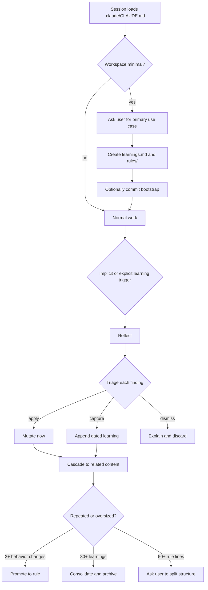

# Case study: Christopher Allen's self-improving Claude Code bootstrap seed

- **Status:** Complete
- **Study date:** 2026-07-28
- **Source:** [Public GitHub Gist](https://gist.github.com/ChristopherA/fd2985551e765a86f4fbb24080263a2f)
- **Pinned revision:** [`860d3f71fef949ff5692c86bb251c571caf53790`](https://gist.github.com/ChristopherA/fd2985551e765a86f4fbb24080263a2f/860d3f71fef949ff5692c86bb251c571caf53790)
- **Author:** Christopher Allen (`ChristopherA`), with collaborative development via Claude Code
- **Source license:** [CC BY 4.0](https://creativecommons.org/licenses/by/4.0/)
- **Related studies:** [`aviadr1/claude-meta`](../claude-meta/README.md), [Hermes Agent](../hermes/README.md)
- **Related design:** [Spec-0001](../../hypothetical-extensions/specs/0001-initial-system-design.md), [Phase 1](../../hypothetical-extensions/specs/0002-phase-1-review-only.md)

## Executive verdict

Christopher Allen's prompt is a thoughtful **bootstrap constitution** for a self-improving Claude Code workspace. It goes well beyond a one-shot reflection prompt by seeding:

- use-case discovery;
- project-local learning and rule files;
- cross-session state conventions;
- reflect/apply/capture/dismiss triage;
- cascade checking;
- Git history;
- context budgets;
- promotion and consolidation thresholds;
- user steering for structural changes; and
- future migration toward rules, hooks, and skills.

Its strongest architectural idea is that structure should emerge from demonstrated pressure rather than being front-loaded. Its strongest operational idea is that every finding must be triaged rather than merely accumulated.

The source accurately calls the proposal **untested**. It supplies no runtime, deterministic trigger, validator, evaluation, fixture, example evolved workspace, or longitudinal outcome. It also lets one model act as detector, classifier, author, mutator, curator, and Git committer. User review is requested for some structural changes and promoted rules, but not for every durable write.

**Recommendation:** adopt triage, anti-proliferation, pressure-driven structure, and user steering as reviewer and curator policies. Adapt its thresholds into review triggers rather than mutation authority. Reject direct, implicit, broad-scope self-mutation and autonomous commits as the trusted control plane.

## Scope and method

The study:

1. fetched the live Gist and its metadata through the GitHub API;
2. cloned and pinned its two-file Git history to revision `860d3f7`;
3. inspected both revisions and all three public comments;
4. compared README claims with the exact seed prompt;
5. checked the prompt against current official Claude Code memory, rules, skills, and hooks behavior; and
6. compared its lifecycle and ownership model with this project's specifications.

The comments include one anecdotal assertion that performance improves when `learnings.md` is “wired up.” They include no tasks, measurements, evolved artifacts, or reproducible evaluation, so this study does not treat them as validation.

## Source reality

The pinned Gist contains two Markdown files:

| File | Lines | Purpose |
| --- | ---: | --- |
| [`README.md`](https://gist.github.com/ChristopherA/fd2985551e765a86f4fbb24080263a2f/860d3f71fef949ff5692c86bb251c571caf53790#file-readme-md) | 107 | Hypothesis, rationale, expected evolution, usage, and limitations |
| [`self-improving-claude-code.md`](https://gist.github.com/ChristopherA/fd2985551e765a86f4fbb24080263a2f/860d3f71fef949ff5692c86bb251c571caf53790#file-self-improving-claude-code-md) | 103 | The prompt copied into `.claude/CLAUDE.md` |

There are two revisions:

1. the initial two-file publication; and
2. a four-line README correction making `.claude/CLAUDE.md` the sole documented installation location.

There is no source code, package, plugin manifest, settings file, hook declaration, skill, test, CI workflow, generated workspace, release artifact, or observed evolution trace. The README explicitly says the system is an unvalidated hypothesis ([lines 93–99](https://gist.github.com/ChristopherA/fd2985551e765a86f4fbb24080263a2f/860d3f71fef949ff5692c86bb251c571caf53790#file-readme-md-L93-L99)).

## Hypothesis versus demonstrated behavior

| Claim or expectation | Evidence in the source | Assessment |
| --- | --- | --- |
| One prompt can bootstrap meaningful improvement | A 103-line project instruction is provided | Plausible prompt pattern, not demonstrated outcome |
| The system captures and promotes learning | Instructions describe learning, promotion, and consolidation | Model-mediated convention only |
| Structure emerges from pressure | Line and entry thresholds request later restructuring | Useful policy; emergence remains subjective and untested |
| It supports four workspace use cases | Session 1 asks the user to choose one of four modes | Choice is seeded; adaptation quality is not tested |
| State survives sessions | Claude is told to maintain a project-local state file | Files persist, but discovery, naming, update timing, and staleness are not deterministic |
| Hooks and skills emerge later | Their affordances are mentioned in three bullets | No creation recipe, trigger, or validated resulting artifact |
| Each session improves the system | The opening imperative says so | Aspirational; sessions can produce no lesson or a harmful lesson |
| Complexity remains lean | Budgets and anti-proliferation rules are specified | Helpful heuristics without enforcement or conflict detection |

The README's session-number evolution path—first state file around session 3, consolidation around session 8, rule split around session 15, hooks or skills after session 20—is illustrative, not derived from measurements ([lines 63–71](https://gist.github.com/ChristopherA/fd2985551e765a86f4fbb24080263a2f/860d3f71fef949ff5692c86bb251c571caf53790#file-readme-md-L63-L71)).

## Actual mechanism



Source: [seed lines 6–17](https://gist.github.com/ChristopherA/fd2985551e765a86f4fbb24080263a2f/860d3f71fef949ff5692c86bb251c571caf53790#file-self-improving-claude-code-md-L6-L17), [39–55](https://gist.github.com/ChristopherA/fd2985551e765a86f4fbb24080263a2f/860d3f71fef949ff5692c86bb251c571caf53790#file-self-improving-claude-code-md-L39-L55), and [62–93](https://gist.github.com/ChristopherA/fd2985551e765a86f4fbb24080263a2f/860d3f71fef949ff5692c86bb251c571caf53790#file-self-improving-claude-code-md-L62-L93).

### Ownership in the seed

- **Human:** chooses the initial use case and is consulted for uncertain or structural evolution decisions.
- **Claude:** detects implicit triggers, reflects, classifies each finding, edits project files, cascades changes, promotes rules, archives entries, maintains state, and commits Git history.
- **`CLAUDE.md`:** supplies the always-loaded operating constitution.
- **`learnings.md`:** acts as an append-oriented candidate and evidence store.
- **`.claude/rules/`:** acts as promoted behavioral policy.
- **State file:** acts as temporary cross-session task continuity.
- **Git:** provides incidental history and human inspectability.

There is no independent proposal boundary, policy engine, ownership registry, mutation journal, or deterministic curator.

## What the seed gets right

### 1. Let complexity emerge from evidence

The seed does not install an elaborate plugin, ontology, database, or agent hierarchy before observing a need. Rules, process documents, workstreams, templates, hooks, and skills are expected to appear only after simpler structures become inadequate ([README lines 15–25](https://gist.github.com/ChristopherA/fd2985551e765a86f4fbb24080263a2f/860d3f71fef949ff5692c86bb251c571caf53790#file-readme-md-L15-L25)).

This is a strong YAGNI discipline. Claude Self-Improvement should preserve it by shipping one releasable learning path before automatic capture, broad mutation modes, or curator automation.

### 2. Triage is better than indiscriminate capture

Each finding receives one disposition:

- apply now;
- capture for later; or
- dismiss with a reason.

This directly addresses memory-dump behavior. It maps well to typed candidate states, provided that “apply now” to a deliverable is separated from authorization to mutate durable agent knowledge.

### 3. Anti-proliferation is explicit

The seed defaults to editing existing artifacts and requires justification for new files. It also supplies context budgets and consolidation triggers ([seed lines 62–81](https://gist.github.com/ChristopherA/fd2985551e765a86f4fbb24080263a2f/860d3f71fef949ff5692c86bb251c571caf53790#file-self-improving-claude-code-md-L62-L81)).

This supports this project's search-before-create rule and preference for expanding an owning umbrella artifact.

### 4. It distinguishes active state from learned behavior

The seed uses a state-file shape—goal, status, done, one concrete next step, and open questions—rather than putting current work into permanent rules ([lines 27–37](https://gist.github.com/ChristopherA/fd2985551e765a86f4fbb24080263a2f/860d3f71fef949ff5692c86bb251c571caf53790#file-self-improving-claude-code-md-L27-L37)).

That separation is correct even though this project's durable-learning system should discard temporary task state rather than own it.

### 5. User steering is part of evolution

The prompt asks the user before structural splits, consolidation choices, uncertain captures, and promoted-rule commits ([lines 88–93](https://gist.github.com/ChristopherA/fd2985551e765a86f4fbb24080263a2f/860d3f71fef949ff5692c86bb251c571caf53790#file-self-improving-claude-code-md-L88-L93)). This is materially safer than silent organic mutation.

### 6. It treats context as a constrained resource

“The context window is a public good” is an effective framing. The seed gives explicit size budgets and promotes progressive disclosure rather than indefinite `CLAUDE.md` growth.

### 7. It acknowledges its own limitations

The README plainly identifies lack of testing, model dependence, cold-start risk, weakness of conversation-partner mode, and absence of enforcement. That makes the proposal easier to assess honestly than one presented as a proven autonomous system.

## Limits and risks

### P0: one model holds every consequential role

Claude identifies a lesson, judges its scope, writes or applies it, cascades it to related content, decides whether it has repeated, promotes it, archives its evidence, and may commit the result. The same inference process generates the proposal and authorizes the mutation.

The user is consulted for promoted rules and structural decisions, but the core loop says “Apply now → make the change” and “Capture → `.claude/learnings.md`” without requiring a preview or approval ([lines 39–55](https://gist.github.com/ChristopherA/fd2985551e765a86f4fbb24080263a2f/860d3f71fef949ff5692c86bb251c571caf53790#file-self-improving-claude-code-md-L39-L55)).

Claude Self-Improvement must keep reviewer output untrusted and separate proposal, approval, and apply.

### P0: project scope receives user, task, and agent knowledge

The four use cases include an “evolving conversation partner” intended to accumulate preferences and interests. The bootstrap then records the use case, user/project context, and decisions in project-local `.claude/` files ([lines 6–25](https://gist.github.com/ChristopherA/fd2985551e765a86f4fbb24080263a2f/860d3f71fef949ff5692c86bb251c571caf53790#file-self-improving-claude-code-md-L6-L25)).

In a shared or published repository this can leak personal preferences, private context, paths, or sensitive facts. It also mixes:

- temporary task state;
- raw dated observations;
- stable project conventions;
- user preferences; and
- reusable procedures.

These classes need different scopes, destinations, retention, and authorization.

### P0: durable writes have no recovery protocol

Git history helps only after a valid commit. The seed defines no:

- exact staged-file review;
- base hash or stale-target check;
- symlink and path-containment validation;
- dirty-tree behavior;
- concurrent-session conflict handling;
- atomic installation;
- recovery journal;
- post-write structural validation; or
- rollback command.

Its Git advice says to commit `.claude/` changes with related work ([lines 57–60](https://gist.github.com/ChristopherA/fd2985551e765a86f4fbb24080263a2f/860d3f71fef949ff5692c86bb251c571caf53790#file-self-improving-claude-code-md-L57-L60)), potentially coupling agent-configuration mutations to unrelated deliverable commits.

### P1: `learnings.md` is not a native memory seam

Current Claude Code automatically loads `CLAUDE.md`, `.claude/rules/`, and auto-memory according to documented rules. An arbitrary `.claude/learnings.md` file is not automatically loaded merely because it exists. The seed adds a pointer phrase to `CLAUDE.md`, but it does not use an `@` import or an unconditional session-start instruction to read `learnings.md`.

As a result, captured entries may be durable on disk yet absent from later context until Claude independently decides to inspect the file. The public comment about ensuring `learnings.md` is “wired up” indirectly points at this gap but does not specify or test the wiring.

Official source: [How Claude remembers your project](https://code.claude.com/docs/en/memory).

### P1: the memory premise is outdated or incomplete

The seed says “Sessions end. Memory doesn't persist. Files do” ([lines 27–29](https://gist.github.com/ChristopherA/fd2985551e765a86f4fbb24080263a2f/860d3f71fef949ff5692c86bb251c571caf53790#file-self-improving-claude-code-md-L27-L29)). A fresh context window does not mean Claude Code now lacks persistent memory. Current Claude Code supports both persistent `CLAUDE.md` instructions and Claude-managed auto-memory.

The useful invariant is narrower: **conversation context is ephemeral; durable state must use a documented persistent mechanism.**

### P1: lifecycle guarantees are written as prose

“Update before session ends” cannot reliably run after process termination, API failure, terminal closure, or an interrupted tool call. “After non-trivial work” is model-defined, so it can trigger too often, too rarely, or inconsistently. “Session start: read state file” depends on Claude discovering the right file.

Deterministic lifecycle requirements belong in hooks or engine behavior, not only in a prompt. The source acknowledges this enforcement limitation.

### P1: promotion can reinforce its own mistake

A learning is promoted after it “changes behavior 2+ times” ([line 72](https://gist.github.com/ChristopherA/fd2985551e765a86f4fbb24080263a2f/860d3f71fef949ff5692c86bb251c571caf53790#file-self-improving-claude-code-md-L72)). That is better than promoting every observation, but behavior change is not evidence of correctness. The first unverified learning can cause the second behavior change and then promote itself.

Promotion needs independent evidence, counterexamples, contradiction search, and ideally held-out evaluation—not repetition alone.

### P1: cascade can broaden a weak generalization

After applying or capturing a finding, Claude is told to apply it consistently to related content or explain why not. The instruction does not require a narrow scope, exact affected-file preview, or approval. A mistaken lesson can therefore expand beyond the original evidence.

The safe analogue is a scoped search for duplicates and sibling owners, followed by one reviewable proposal.

### P1: implicit reflection creates unbounded normal-turn cost

The loop may run after any “non-trivial work.” That invites end-of-task reflection, file writes, state updates, and possible commits even when no durable lesson exists. It can also compete with the user's immediate goal.

This project's first release correctly uses an explicit trigger. Later automatic capture must remain bounded, fail open, and create candidates only.

### P1: no privacy or content policy

The seed instructs dated context capture but defines no credential filtering, transcript minimization, sensitive-data classes, repository-visibility check, or rejection policy. Raw context is especially risky in conversation-partner and personal-knowledge modes.

### P2: future affordance hints are not implementation recipes

The prompt mentions `hooks/` and `skills/` as future affordances ([lines 83–86](https://gist.github.com/ChristopherA/fd2985551e765a86f4fbb24080263a2f/860d3f71fef949ff5692c86bb251c571caf53790#file-self-improving-claude-code-md-L83-L86)). Claude Code does not discover a capability from those bare directories alone:

- project skills require `.claude/skills/<name>/SKILL.md`; and
- hooks require declarations in settings, plugin configuration, or component frontmatter, with scripts only as handlers.

Official sources: [Skills](https://code.claude.com/docs/en/skills) and [Hooks](https://code.claude.com/docs/en/hooks).

### P2: line and entry budgets are useful but crude

A 50-line rule can be cohesive; a 10-line rule can contain three conflicting concerns. Thirty learning entries can be harmless or already unusable. Thresholds should schedule review, not determine semantic structure by themselves.

## Relationship to `claude-meta`

| Concern | `claude-meta` | Bootstrap seed |
| --- | --- | --- |
| Installation | Starter `CLAUDE.md` template | 103-line `.claude/CLAUDE.md` seed |
| Trigger | Human invokes one reflection prompt | Implicit after non-trivial work plus explicit phrases |
| Core reasoning | Reflect, abstract, generalize | Reflect, triage, cascade |
| Initial store | `CLAUDE.md` | `learnings.md`, `rules/`, and state files |
| Curation | Summary and anti-bloat prose | Promotion, consolidation, archive, split thresholds |
| User review | Not required before direct edit | Required for selected structural/promoted changes |
| Context strategy | One growing broad file | Small root instructions plus conditional rules and archives |
| Claimed maturity | Full production example supplied | Explicitly untested hypothesis |
| Main strength | Five-second learning interaction | Pressure-driven evolution policy |
| Main risk | Unbounded single-file rules | Broad agent-owned project mutation lifecycle |

The seed is a more mature prompt architecture than `claude-meta`, particularly in triage, progressive disclosure, and anti-proliferation. Both still rely on prompt compliance and direct model writes rather than a trusted mutation boundary.

## Comparison with Claude Self-Improvement

| Concern | Bootstrap seed | Claude Self-Improvement design |
| --- | --- | --- |
| Initial trigger | Implicit or explicit | Explicit `/self-improvement:learn` |
| Detector | Current Claude conversation | User first; bounded hooks later |
| Evidence | Free-form current context and dated notes | Bounded typed evidence |
| Disposition | Apply, capture, dismiss | Typed candidate/proposal lifecycle |
| Destination | Project-local learnings, rules, state | Memory, instruction, rule, skill, hook proposal, reference, or discard |
| Authorization | Model, with selective user questions | Deterministic policy plus explicit approval |
| Mutation | Claude file and Git tools | Journaled `claude-si` engine |
| Temporary state | Maintained under `.claude/` | Outside durable-learning ownership; discard as knowledge |
| Promotion | Two behavior changes | Evidence, ownership, duplicate search, review, validation |
| Curation | Entry/line thresholds and model judgment | Deterministic scheduling plus review-gated curator |
| Recovery | Git if available and correctly committed | Journal, observed hashes, conflict detection, rollback |
| Privacy | Undefined | Redaction, credential canaries, minimal evidence |
| Enforcement | Prompt only | Hooks/settings for deterministic requirements |
| Evaluation | None | Packaged fresh-session and later quality baselines |
| Complexity strategy | Emerge from pressure | Narrow tracer bullet, then separately gated increments |

## Adopt, adapt, and reject

### Adopt

1. **Pressure-driven architecture:** add structure only after simpler artifacts show measured strain.
2. **Typed disposition:** every candidate should be applied to the task, captured for review, or dismissed with a reason.
3. **Anti-proliferation:** search and patch an owner before creating another artifact.
4. **User steering:** ask before scope, ownership, or structural changes.
5. **Context budgets:** treat always-loaded instructions as a scarce resource.
6. **State/knowledge separation:** current work is not durable learning.
7. **Evolution history:** expose attributable artifact history to the user.

### Adapt

1. Interpret **apply now** as fixing the current deliverable, not authorizing durable-knowledge mutation.
2. Interpret **capture** as creating a bounded candidate, not appending raw conversation context.
3. Interpret **dismiss** as a terminal candidate state with a compact reason and retention policy.
4. Replace **cascade and apply** with **search sibling owners and propose a scoped patch**.
5. Use line/entry thresholds to enqueue curation review, never to authorize changes.
6. Require evidence that a learning improved an independent task before promotion.
7. Keep temporary task continuity in the host/session system rather than the learning store.
8. Use documented exact paths and schemas when proposing skills, rules, or hooks.

### Reject

1. Autonomous Git commits as part of bootstrap or routine learning.
2. Project-local storage of personal conversation-partner memory by default.
3. Direct durable writes from the same model action that identifies the lesson.
4. Implicit reflection after every vaguely “non-trivial” task.
5. Repetition as sufficient proof of correctness.
6. Raw dated context as the default candidate database.
7. Prompt prose as a lifecycle or enforcement guarantee.

## Concrete implications for this project

### Preserve the narrow first release

The seed reinforces—not weakens—the decision to ship an explicit CLI tracer bullet before automatic hooks and broad mutation modes. Its philosophy is to let complexity emerge from pressure; front-loading Phase 2 and Phase 3 machinery would violate that lesson.

### Add disposition to the reviewer contract

A reviewer proposal should state one of:

- `apply_to_current_task_only`;
- `propose_durable_learning`;
- `defer_for_more_evidence`; or
- `dismiss`.

This preserves the seed's strongest anti-dump behavior while keeping durable writes review-gated.

### Add pressure signals without granting authority

Future curator scheduling may use deterministic signals such as:

- artifact line count;
- repeated semantically similar candidates;
- conflicting instructions;
- stale age;
- failed invocations;
- context cost; and
- multiple successful uses.

These signals trigger review. They do not choose the final structure or mutate human-owned content.

### Add a bootstrap-seed evaluation baseline

Future quality evaluation should compare:

1. current Claude Code with native auto-memory;
2. the `claude-meta` explicit reflection prompt;
3. this bootstrap seed; and
4. Claude Self-Improvement's reviewed workflow.

Run each against fresh repositories and fresh sessions. Measure capture precision, false promotion, duplicate artifacts, context cost, task interference, sensitive-data persistence, recovery, cross-session reuse, and user review effort.

### Keep the front door simpler than the machinery

The system should retain the seed's low-friction interaction:

```text
/self-improvement:learn
```

Internally, it may classify, route, validate, stage, request approval, journal, and verify. Those controls should not force the user to manually manage the control plane.

## Keep / defer / avoid

| Decision | Item | Reason |
| --- | --- | --- |
| Keep now | Explicit learning trigger | High signal and low normal-turn cost |
| Keep now | Apply/capture/dismiss disposition | Prevents undifferentiated accumulation |
| Keep now | Search-before-create and context discipline | Controls duplication and startup cost |
| Keep now | User approval and exact staged files | Supplies the missing authorization boundary |
| Defer | Automatic implicit capture | Must first prove bounded precision and fail-open behavior |
| Defer | Existing-file mutation | Requires ownership, conflict, validation, and recovery controls |
| Defer | Automated consolidation | Thresholds can schedule review before curator mutation exists |
| Avoid | Raw project-local learning dump | Wrong scope, retention, and privacy behavior |
| Avoid | Autonomous commits | Conflates agent learning with repository history authority |
| Avoid | Cascade-by-default mutation | Amplifies weak generalizations |

## Final assessment

The bootstrap seed is a useful product and architecture reference precisely because it asks how little machinery can create a useful learning habit. Compared with `claude-meta`, it adds much better triage, context discipline, user steering, and an explicit model for structural evolution.

It remains a constitution, not a control plane. Its thresholds, lifecycle instructions, and future affordance hints are interpreted by the same model that writes the artifacts. The source offers no evidence yet that the predicted evolution occurs safely or improves held-out work.

For Claude Self-Improvement, the right synthesis is:

> Let structure emerge from measured pressure, and require every lesson to be applied, captured, deferred, or dismissed—but never let the model's own triage decision authorize an unrecoverable durable mutation.

That keeps the seed's disciplined minimalism while adding the ownership, privacy, verification, and recovery boundaries needed for a trustworthy system.
