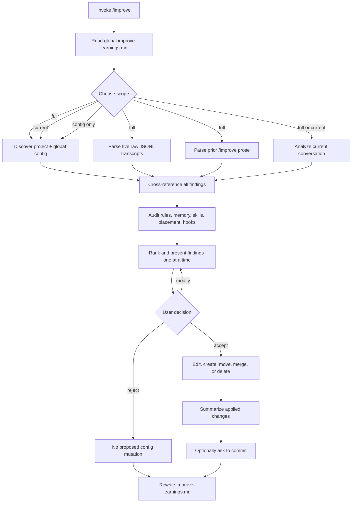

# Case study: `TerenceBristol/claude-improve`

- **Status:** Complete
- **Study date:** 2026-07-28
- **Source:** [`TerenceBristol/claude-improve`](https://github.com/TerenceBristol/claude-improve)
- **Pinned commit:** [`ae7ce8cc61d905ef1032b164d4097a4c4b248716`](https://github.com/TerenceBristol/claude-improve/tree/ae7ce8cc61d905ef1032b164d4097a4c4b248716)
- **Pinned release:** [`v3.2.0`](https://github.com/TerenceBristol/claude-improve/releases/tag/v3.2.0)
- **Source license:** [MIT](https://github.com/TerenceBristol/claude-improve/blob/ae7ce8cc61d905ef1032b164d4097a4c4b248716/LICENSE)
- **Related studies:** [bootstrap seed](../bootstrap-seed/README.md), [`aviadr1/claude-meta`](../claude-meta/README.md), [Hermes Agent](../hermes/README.md)
- **Related design:** [Spec-0001](../../hypothetical-extensions/specs/0001-initial-system-design.md), [Phase 1](../../hypothetical-extensions/specs/0002-phase-1-review-only.md), [Phase 2](../../hypothetical-extensions/specs/0003-phase-2-trusted-automatic-updates.md)

## Executive verdict

`claude-improve` is the most operationally developed prompt-level system in these case studies. It is a real Claude Code custom command, not merely a manifesto. One 578-line Markdown file instructs Claude to discover configuration, mine recent sessions, classify evidence, audit placement, present recommendations individually, apply accepted changes, and adapt future recommendations from acceptance history.

Its strongest contributions are:

- an explicit three-way scope choice;
- one-finding-at-a-time review;
- evidence and confidence fields;
- bidirectional routing among instructions, rules, skills, and memory;
- prior-change verification;
- consolidate-before-clean and verify-before-remove gates; and
- graceful degradation when optional analysis fails.

The repository also shows genuine iterative refinement. Releases `v3.1.0` and `v3.2.0` added grep-backed deletion checks to address unsafe-consolidation risks identified in the changelog. That observable source evolution is more informative than an untested prompt claim.

It is still a **model-mediated command, not a trustworthy mutation engine**. The model-driven workflow discovers evidence, interprets private transcripts, decides scope and semantic equivalence, authors changes, generates hook settings and shell logic, edits settings, deletes files, and records its own learning without an independent engine separating those authorities. Approval covers a prose recommendation rather than an exact patch. There is no mutation journal, backup protocol, atomic recovery, provenance record, rollback procedure, privacy boundary, deterministic parser, fixture suite, CI, or fresh-session outcome evaluation.

Two source claims are materially overstated:

1. “Nothing changes without your approval” does not include `~/.claude/improve-learnings.md`, which the command updates after every completed workflow that reaches its save phase, even when no recommendation is applied.
2. A generated hook is not “100% deterministic” enforcement. Claude Code deterministically invokes a matching hook, but generated event selection, matcher coverage, shell logic, input handling, and failure behavior may still be wrong.

**Recommendation:** adopt the finding schema, typed placement audit, individual review, prior-change verification, and two-stage deletion checks. Implement them in a deterministic, privacy-bounded engine with exact patches, journaled recovery, provenance, rollback, and acceptance tests. Do not adopt broad transcript scraping, direct global mutation, generated hooks without separate review, or self-authored learning state as trusted control-plane behavior.

## Scope and method

This study:

1. cloned and pinned the repository to release commit `ae7ce8c`;
2. inspected every tracked file, all five release tags, commit history, release metadata, issues, and pull requests;
3. traced the complete command from discovery through durable mutation;
4. checked installation, skill invocation, memory, session, and hook assumptions against current official Claude Code documentation;
5. ran repository structure, frontmatter, link, release, and provenance checks;
6. performed a content-free schema probe over the available local Claude Code transcript sample; and
7. compared the workflow with this project's ownership, privacy, review, mutation, recovery, and evaluation requirements.

The command was not invoked against Anton's real Claude configuration. It has no dry-run mode, reads broad private state, and writes its learning file after a completed workflow reaches the save phase. A safe isolated model-backed smoke test was unavailable because the installed Claude Code CLI reported no active authentication. This limitation is recorded rather than replaced with fabricated runtime results.

## Source reality

The pinned repository contains four tracked files:

| File | Lines | Purpose |
| --- | ---: | --- |
| [`improve.md`](https://github.com/TerenceBristol/claude-improve/blob/ae7ce8cc61d905ef1032b164d4097a4c4b248716/improve.md) | 578 | Entire executable skill/command prompt |
| [`README.md`](https://github.com/TerenceBristol/claude-improve/blob/ae7ce8cc61d905ef1032b164d4097a4c4b248716/README.md) | 158 | Installation, workflow, claims, examples, and credits |
| [`CHANGELOG.md`](https://github.com/TerenceBristol/claude-improve/blob/ae7ce8cc61d905ef1032b164d4097a4c4b248716/CHANGELOG.md) | 98 | Evolution from `v1.0.0` through `v3.2.0` |
| [`LICENSE`](https://github.com/TerenceBristol/claude-improve/blob/ae7ce8cc61d905ef1032b164d4097a4c4b248716/LICENSE) | 21 | MIT license |

There is no executable program source beyond the prompt, deterministic parser, bundled shell script, fixture, test, evaluation, CI workflow, plugin manifest, package manifest, dependency lock, schema, generated example, or machine-readable mutation record.

The five GitHub releases point to source tags. `v3.2.0` has no attached binary or packaged skill asset. Its tag resolves to an unsigned commit and is lightweight rather than a signed annotated release tag. These facts do not make a four-file source repository unsafe, but they mean installation provenance is only “copy this file from this checkout”; the installed copy carries no version or source hash.

The repository had no issue or pull-request corpus at inspection time. The changelog is therefore the principal public record of defects and design evolution.

## What it actually is

The README calls `/improve` a skill, while installation copies it to the legacy personal custom-command location:

```text
~/.claude/commands/improve.md
```

This works today. Official [Claude Code skill documentation](https://code.claude.com/docs/en/skills) says custom commands have been merged into skills and `.claude/commands/*.md` remains supported. The recommended modern package shape is `~/.claude/skills/improve/SKILL.md`, which can also carry supporting scripts, references, invocation controls, and tool restrictions.

The command has only `name` and `description` frontmatter. It does not declare:

- `disable-model-invocation: true` for a consequential user-only operation;
- an allowed-tool boundary;
- a context mode;
- a version;
- a source revision; or
- an ownership or mutation policy.

Under current skill semantics, absence of `disable-model-invocation: true` leaves model invocation available when the description appears relevant. The command asks for scope before mutation, which limits damage, but a broad configuration retrospective should still be explicitly user-invoked.

## Actual workflow



### Discovery

The discovery agent searches project and user scopes for `CLAUDE.md`, commands, skills, agents, rules, settings, memory, voice/brand files, frameworks, and any other instruction-like Markdown ([lines 44–57](https://github.com/TerenceBristol/claude-improve/blob/ae7ce8cc61d905ef1032b164d4097a4c4b248716/improve.md#L44-L57)). This provides broad coverage but no exclusion policy for secrets, private notes, third-party worktrees, managed configuration, or unrelated personal files.

### Session mining

The history agent is told to write a Bash script that takes the five latest raw JSONL files, extracts entries whose type is `human`, keyword-filters their text, and saves matches to a temporary file ([lines 59–80](https://github.com/TerenceBristol/claude-improve/blob/ae7ce8cc61d905ef1032b164d4097a4c4b248716/improve.md#L59-L80)).

This is not a stable integration seam. Current official [session documentation](https://code.claude.com/docs/en/sessions#where-transcripts-are-stored) explicitly says the raw JSONL entry format is internal, changes between versions, and can break direct parsers. It recommends `/export`, structured CLI output, hook-provided `transcript_path`, or SDK interfaces instead.

A content-free local probe with Claude Code `2.1.214` inspected only aggregate entry types from the available transcript sample:

| Probe | Result |
| --- | ---: |
| Transcript files available | 1 |
| JSONL entries | 8 |
| Top-level types | `attachment=3`, `queue-operation=2`, `user=1`, `assistant=1`, `last-prompt=1` |
| Top-level `type: human` entries | 0 |
| Malformed entries | 0 |

This small sample does not establish every current transcript shape, and the upstream-generated Bash parser was not executed. It shows narrowly that an exact top-level `type == "human"` filter would select zero entries in the sampled file. That is the kind of schema-drift failure the official docs warn about. The command's documented fallback degrades to current-conversation analysis rather than corrupting files, which is good, but the advertised historical feature is version-fragile.

The parser also has privacy and reliability problems:

- raw user messages may include credentials, personal information, client data, and private conversations;
- the temporary path, permissions, retention, and cleanup are unspecified;
- keyword matches such as “yes,” “no,” and “should” have weak semantic precision;
- “no cap on signals” creates unbounded cost and exposure;
- assistant messages and tool outcomes are omitted, removing the context needed to tell whether feedback was addressed; and
- dates and brief quotations enter subagent and main-model context without redaction.

The full-scope parallel plan also contains an unresolved data dependency. It says to launch History Scan and Prior-Improve simultaneously ([lines 36–38](https://github.com/TerenceBristol/claude-improve/blob/ae7ce8cc61d905ef1032b164d4097a4c4b248716/improve.md#L36-L38)), but Prior-Improve must operate on “each session file identified by History Scan” ([lines 82–88](https://github.com/TerenceBristol/claude-improve/blob/ae7ce8cc61d905ef1032b164d4097a4c4b248716/improve.md#L82-L88)). No shared manifest, independent discovery step, or second-wave handoff supplies that future result. A model may improvise around the gap, but the workflow as written is not causally executable.

### Cross-reference and routing

The most reusable part is the content-placement model. It checks five directions:

1. `CLAUDE.md` to a skill;
2. memory to a skill;
3. skill to `CLAUDE.md`;
4. `CLAUDE.md` to memory; and
5. duplicated content between skills.

It also checks cross-level duplication, contradictory instructions, path-scoped rule opportunities, oversized procedural sections, skill-description quality, and memory lifecycle. This is a useful prototype for a typed resolver rather than a reason to let the model mutate every destination directly.

The command's placement rubric is close to this project's intended routing:

| Content | `claude-improve` recommendation | This project's interpretation |
| --- | --- | --- |
| Universal behavioral instruction | `CLAUDE.md` | Human-owned instruction candidate; exact review required |
| Path-specific instruction | `.claude/rules/` | Rule candidate; verify platform semantics and ownership |
| Reusable procedure | Skill | Skill candidate with provenance and fresh-session test |
| Fact or reference | Auto memory | Memory candidate after privacy, durability, and scope checks |
| Repeated violation | Hook | Enforcement candidate requiring threat analysis and independent validation |

### Review

Each finding includes tier, confidence, source, target file, and proposed action. Findings are presented individually through `AskUserQuestion`, with Accept, Reject, or Modify ([lines 450–481](https://github.com/TerenceBristol/claude-improve/blob/ae7ce8cc61d905ef1032b164d4097a4c4b248716/improve.md#L450-L481)). This is substantially safer than autonomous bulk editing.

The approval object is still prose, not an exact mutation. It does not bind:

- a base file hash;
- exact old and new bytes;
- all affected paths;
- generated hook scripts;
- deletion and archive semantics;
- a validation plan;
- recovery metadata; or
- an expiry time.

The model can therefore interpret an accepted summary differently during Phase 6. The “Modify” path is even less precise unless the user restates an exact patch.

### Mutation

An accepted finding can cause the command to:

- edit user or project instructions;
- create rules and skills;
- edit `settings.json`;
- add settings entries intended to execute model-generated hook shell logic;
- merge and delete memory files;
- remove source sections after moving content;
- update `MEMORY.md`; and
- write feedback memories.

For ten or more changes, it may distribute edits to parallel subagents, excluding only two agents editing the same file in one wave ([lines 483–539](https://github.com/TerenceBristol/claude-improve/blob/ae7ce8cc61d905ef1032b164d4097a4c4b248716/improve.md#L483-L539)). That avoids simple write collisions but not semantic dependencies across files, such as moving content from an instruction to a skill while another wave updates its memory index.

The command asks whether to commit only after changes. Git cannot recover untracked or user-global files reliably, and no pre-mutation snapshot is required. There is no crash recovery if a move, merge, index update, or multi-wave operation stops halfway through.

### Self-learning state

At the start of a run, the command reads `~/.claude/improve-learnings.md` and uses prior acceptance rates to boost or deprioritize finding categories. After Phase 6 completes and the workflow reaches its save phase, it writes a dated acceptance summary and inferred preferences, then compacts entries after 80 lines ([lines 14–21](https://github.com/TerenceBristol/claude-improve/blob/ae7ce8cc61d905ef1032b164d4097a4c4b248716/improve.md#L14-L21), [lines 541–564](https://github.com/TerenceBristol/claude-improve/blob/ae7ce8cc61d905ef1032b164d4097a4c4b248716/improve.md#L541-L564)).

This is transparent and resettable, but it has no explicit approval, schema, version, provenance, category floor, or quality outcome. Acceptance is a preference signal—not evidence that a recommendation improved later behavior. Deprioritizing repeatedly rejected categories may suppress important findings, including safety findings, unless critical classes are exempt.

## Claims versus evidence

| Upstream claim | Observed implementation | Assessment |
| --- | --- | --- |
| “One command makes your AI agents get better after every conversation” | One model-run proposes and applies instruction changes | Aspirational; no longitudinal behavior evaluation |
| “Nothing changes without your approval” | Proposed config changes are reviewed; the learning file is updated after a completed workflow reaches its save phase | False as an absolute claim |
| “No dependencies” | No package dependencies; workflow requires Claude Code, shell tools, Bash generation, filesystem layout, and subagents | Reasonable only in the narrow package-manager sense |
| “Works on any project structure” | Broad discovery plus hard-coded fallbacks and project-specific heuristics | Broadly adaptable, not universal |
| Historical analysis | Direct parser for internal JSONL and `type: human` | Version-fragile; that exact filter would select zero entries in the available local sample |
| Hook conversion gives 100% deterministic enforcement | Claude generates event, matcher, JSON, and shell logic | Hook invocation can be deterministic; enforcement correctness is not |
| Prior accepted changes are verified | Key text is grepped in target files | Presence check, not behavioral or semantic verification |
| Redundant memories are safe to delete | Grep before presentation, integrate before cleanup, grep again before removal | Strong prompt-level guard; still no backup, exact semantic proof, or transaction |
| Confidence is evidence-based | Thresholds use signal count, recurrence, or direct correction | Useful presentation heuristic, not calibrated confidence |
| Self-learning adapts to the user | Acceptance aggregates influence ranking and style | Preference adaptation exists; outcome improvement is unmeasured |
| Research supports fixed compliance and activation numbers | Prompt cites ~80%, 20–90%, and “linear decay” without sources | Unsupported in the repository |

One internal inconsistency is concrete: the README says Promotion means a pattern repeated **3+ times** ([line 98](https://github.com/TerenceBristol/claude-improve/blob/ae7ce8cc61d905ef1032b164d4097a4c4b248716/README.md#L98)), while the command promotes the same feedback after **2+ sessions** ([lines 200–210](https://github.com/TerenceBristol/claude-improve/blob/ae7ce8cc61d905ef1032b164d4097a4c4b248716/improve.md#L200-L210)). There is no test to detect this drift.

## Strengths worth retaining

### 1. Findings are explicit review units

Tier, confidence, evidence source, target, rationale, and proposed action are better than an opaque “improve my config” request. This project's candidate schema should preserve those fields and add exact patch, provenance, privacy, ownership, validation, recovery, and expiry metadata.

### 2. Safety evolved in response to use

The changelog records a clear progression:

- `v3.1.0`: verify redundancy, integrate before cleanup, and review consolidation during the interactive phase;
- `v3.2.0`: batch-verify all proposed deletions and verify again immediately before removal.

This is valuable evidence that deletion safety needs more than a single model judgment. The two-stage gate should primarily inform Phase 3 curation and reversible archival, built on Phase 2's reviewed mutation and recovery machinery and implemented with deterministic validators.

### 3. Placement is bidirectional

Many systems only promote transient learning into increasingly global instructions. This command also demotes factual content into memory and moves narrow procedures into skills or path-scoped rules. That fights context bloat and recognizes that “more persistent” is not always “more global.”

### 4. Rejected and drifted findings remain visible

The prior-run audit tries to distinguish implemented, drifted, missing, and repeatedly rejected recommendations. This is a useful accountability pattern. It should be backed by durable IDs and exact mutation receipts rather than parsing generated Markdown tables from transcripts.

### 5. Failure degradation is explicit

Optional history failure does not block current-session or config analysis, and the command requires announcing skipped evidence. This is the correct user-facing behavior for partial analysis.

### 6. It distinguishes instruction from enforcement

The command correctly recognizes that `CLAUDE.md` is probabilistic context and hooks run at lifecycle events. The flaw is not the distinction; it is allowing an unvalidated model-generated hook to cross directly into execution authority.

## Safety and reliability gaps

### Broad privacy exposure

All three scopes discover and read broad global/project configuration without data minimization, consent by source, redaction, retention control, or sensitive-path exclusions. Full scope additionally mines prior user messages. “Current conversation only” therefore limits transcript analysis, not configuration access, and no scope previews the exact paths or sessions that will be opened.

### Human-owned artifacts lack exact-diff authorization

The command treats `CLAUDE.md`, skills, settings, hooks, and memory as equivalent writable configuration. It does not distinguish human-owned from system-owned artifacts. A user sees and approves a proposed action, so the mutation is not wholly silent, but approval is not bound to the exact resulting diff. This falls short of the project's ownership and exact-review requirements for human-authored instructions.

### Direct auto-memory writes cross an unverified seam

The command does not merely recommend auto-memory conceptually. It instructs Claude to merge and delete topic files, rewrite `MEMORY.md`, create `feedback_[topic].md`, and update the index ([lines 503–516](https://github.com/TerenceBristol/claude-improve/blob/ae7ce8cc61d905ef1032b164d4097a4c4b248716/improve.md#L503-L516)). These are direct external mutations of Claude-managed memory internals.

Claude Code documents auto-memory as a feature and exposes its Markdown for user inspection. This project's proposed architecture nevertheless classifies the **external mutation contract** as unverified and keeps auto-memory read-only for duplicate discovery ([Spec-0001 lines 43–55](../../hypothetical-extensions/specs/0001-initial-system-design.md#verified-platform-seams)). Phase 1 expressly forbids editing it, and Phase 2 retains direct auto-memory mutation as a non-goal. Until a supported, versioned resolver and mutation contract is verified, these writes should not enter the trusted engine.

### Deletion is verified but not recoverable

Grep evidence reduces false redundancy claims but cannot prove complete semantic equivalence. A matching sentence may differ in scope, priority, surrounding rationale, or path applicability. Even a correct deletion lacks archive, backup, transaction, and rollback metadata.

### Generated hooks cross a high-risk boundary

Official Claude Code hook documentation warns that command hooks run with the user's full permissions and recommends input validation, quoting, traversal protection, absolute paths, and sensitive-file exclusions. The skill checks only paths containing spaces. It does not require threat modeling, fixtures, shell linting, isolated execution, failure-mode tests, or separate approval of the final script and settings patch.

### Generic distribution contains author-specific learning

The published command says “The user values opinionated recommendations” ([lines 428–434](https://github.com/TerenceBristol/claude-improve/blob/ae7ce8cc61d905ef1032b164d4097a4c4b248716/improve.md#L428-L434)), names author-specific example skills such as `ticket-writer` and `ft-testing`, and closes with a June 2026 lesson that one-at-a-time presentation achieved “100% acceptance” ([lines 566–578](https://github.com/TerenceBristol/claude-improve/blob/ae7ce8cc61d905ef1032b164d4097a4c4b248716/improve.md#L566-L578)).

The generic distribution of apparently user-specific prose is strong evidence of scope contamination, although the repository does not prove how those sentences originated or whether the same session produced them. A one-session acceptance result does not establish universal utility or correctness. This project's provenance and scope classifier exists specifically to prevent an unreviewed personal-to-shared promotion.

### No deterministic evidence pipeline

Session extraction, finding classification, equivalence, confidence, placement, prose-table parsing, patching, and validation are all model judgments. The source contains no reproducible input/output fixture, expected finding set, false-positive benchmark, privacy test, crash test, rollback test, or fresh-session behavior test.

### Platform and version assumptions

The history agent explicitly generates Bash, so “any project” does not mean any supported operating environment. Auto-memory paths, raw JSONL, settings schema, skill budgets, and hook events can change with Claude Code. Some assumptions are marked unofficial; others are presented as fixed facts.

## Comparison with Claude Self-Improvement

This is a source-to-design comparison. Claude Self-Improvement's specifications are **Proposed**, and the repository has not accepted a runtime implementation.

| Concern | `claude-improve` | Claude Self-Improvement design |
| --- | --- | --- |
| Trigger | Slash command; model invocation not disabled | Explicit user-triggered Phase 1 intake |
| Runtime | One 578-line model prompt | Plugin adapter plus deterministic local engine |
| Evidence | Current context, private raw transcripts, config scan | Typed, privacy-filtered evidence envelope |
| Candidate | Prose finding | Durable typed candidate with provenance |
| Routing | Model chooses among instruction/rule/skill/memory/hook | LLM destination proposal constrained by deterministic authorization policy |
| Approval | Accept/Reject/Modify summary | Exact mutation proposal tied to base state |
| Ownership | No human/system distinction | Explicit owner and mutation authority |
| Mutation | Model edits files directly | Journaled state machine with backups and recovery |
| Deletion | Grep, integrate, grep again, then delete | Archive-first, provenance-preserving, reversible |
| Hooks | Model writes settings intended to execute generated shell logic | Separate high-risk artifact with independent tests and approval |
| Privacy | Broad scan; no exclusions or redaction | Data minimization and sensitive-content rejection |
| Concurrency | Same-file exclusion across waves | Serialized journal or explicit dependency graph |
| Verification | Grep/text presence and summary table | Structural validation; fresh packaged-session evidence for the narrow Phase 1 skill path |
| Learning | Acceptance-rate Markdown | Outcome evidence separated from preference evidence |
| Platform seam | Raw internal JSONL and copied command | Documented APIs and certified adapters; bounded versioned transcript parsing only as a compatibility fallback |
| Rollback | Git offered after mutation | Recovery metadata required before mutation |

## Adopt, adapt, reject

### Adopt

- three explicit analysis scopes;
- one-at-a-time candidate review;
- tier, confidence, evidence source, target, and rationale fields;
- bidirectional content-placement analysis;
- prior-change drift reporting;
- consolidate-before-clean;
- verification at proposal time and again at execution time;
- explicit degraded-mode announcements; and
- limits and health checks for always-loaded context.

### Adapt

- convert findings into typed candidates with immutable evidence references;
- replace prose confidence with evidence counts and calibrated policy labels;
- bind approval to exact patches and base hashes;
- make deletion archive-first and journaled;
- treat acceptance patterns as user preferences, never outcome evidence;
- exempt critical safety categories from adaptive deprioritization;
- replace direct JSONL parsing with supported session/export/SDK interfaces;
- split the long command into a small manually invoked skill plus deterministic scripts and references;
- package version and source revision with the installed artifact; and
- test generated hooks in isolation before a separate installation approval.

### Reject

- broad unredacted transcript mining;
- durable learning writes outside the approval contract;
- direct global instruction and settings mutation;
- settings entries that execute unvalidated model-generated hook shell logic;
- irreversible deletion based on grep;
- parallel cross-file mutation without a transaction or dependency graph;
- self-reported “verified” status based only on phrase presence;
- universal promotion of one user's preferences; and
- unsupported fixed compliance, activation, and confidence numbers.

## Concrete implications for this repository

1. **Keep Phase 1 narrow.** This study validates the decision not to begin with broad instruction, memory, settings, and hook mutation.
2. **Add a formal finding schema.** Include category, evidence source, confidence basis, target recommendation, scope, owner, privacy class, exact patch, validation, and rollback plan.
3. **Make placement bidirectional.** The resolver should be able to demote, narrow, or archive guidance—not only promote it.
4. **Verify twice before retirement.** Validate equivalence when proposing retirement and again against the approved base state immediately before archiving.
5. **Never parse raw session JSONL as a stable contract.** Use supported exports, hook inputs, structured CLI output, or SDK session APIs, and version every adapter.
6. **Separate preference evidence from quality evidence.** Accept/reject/modify history can tune presentation, but only fresh-session task outcomes can support behavioral improvement claims.
7. **Require manual invocation for consequential retrospectives.** The eventual skill should opt out of model invocation and declare a least-privilege tool boundary.
8. **Treat hooks as executable software.** Require source, threat model, tests, exact review, and rollback; do not describe hook correctness as automatic.
9. **Prevent scope contamination.** A personal preference must not enter a shared skill without explicit reclassification and review.
10. **Preserve rejected candidates by ID, not transcript prose.** Reconsideration and drift audits should query structured records rather than scrape prior generated tables.
11. **Create adversarial fixtures from the observed gaps.** Tests should cover schema drift, misleading grep matches, duplicate-but-different scope, secrets in user messages, interrupted multi-file moves, conflicting wave edits, rejected safety categories, and hook-generation failures.
12. **Retain the upstream's strongest UX.** Present one opinionated recommendation at a time, explain degraded evidence, and let the reviewer accept, reject, or request a revised exact patch.

## Final assessment

`claude-improve` is a valuable advanced prototype and a particularly useful failure study. It demonstrates that a carefully written command can provide strong retrospective UX, broad configuration reasoning, and progressively improved prompt-level safety. It also demonstrates why prompt-level safety is not enough once the workflow can read private history, rewrite human instructions, delete memory, edit settings, and add settings entries that execute model-generated shell logic.

The right synthesis is:

> Keep the individual review, typed placement, drift audit, and verify-before-remove discipline. Move evidence handling, authorization, mutation, recovery, provenance, privacy, and validation out of the model prompt and into a deterministic local control plane.
