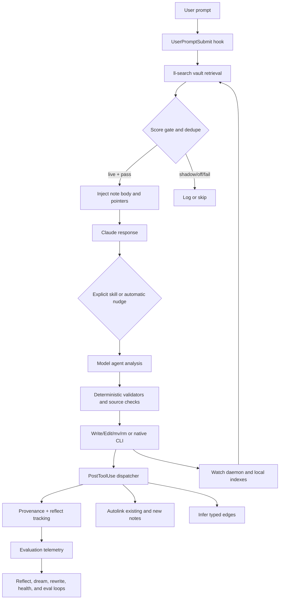

# Case study: `robinslange/learning-loop`

- **Status:** Complete
- **Study date:** 2026-07-28
- **Source:** [`robinslange/learning-loop`](https://github.com/robinslange/learning-loop)
- **Pinned commit:** [`b45997b129722951325ab15ccc7372eb44ea39d1`](https://github.com/robinslange/learning-loop/tree/b45997b129722951325ab15ccc7372eb44ea39d1)
- **Latest release at inspection:** [`v1.39.1`](https://github.com/robinslange/learning-loop/releases/tag/v1.39.1), commit [`db8585f`](https://github.com/robinslange/learning-loop/tree/db8585f17f145abf96d4795f428fd2ae9aad020b)
- **Source license:** [Apache-2.0](https://github.com/robinslange/learning-loop/blob/b45997b129722951325ab15ccc7372eb44ea39d1/LICENSE), with third-party attribution in [`NOTICE`](https://github.com/robinslange/learning-loop/blob/b45997b129722951325ab15ccc7372eb44ea39d1/NOTICE)
- **Related studies:** [`claude-improve`](../claude-improve/README.md), [`claude-meta`](../claude-meta/README.md), [bootstrap seed](../bootstrap-seed/README.md), [Hermes Agent](../hermes/README.md)
- **Related design:** [Spec-0001](../../specs/0001-initial-system-design.md), [Phase 1](../../specs/0002-phase-1-review-only.md), [Phase 2](../../specs/0003-phase-2-trusted-automatic-updates.md), [Phase 3](../../specs/0004-phase-3-skill-curator.md)

## Executive verdict

`learning-loop` is not one self-improvement prompt. It is a large Claude Code plugin and local knowledge system: 731 tracked files, 24 skills, 20 agents, JavaScript hooks and scripts, a multi-crate Rust search engine, an Obsidian vault schema, auto-memory workflows, research and citation verification, retrieval telemetry, consolidation-evaluation scaffolding, optional federation, cross-instance harvesting, and native release artifacts.

Among the implementations reviewed, it has the broadest observed architecture and operational surface. It demonstrates several ideas worth carrying forward:

- split deterministic mechanics from model judgment;
- inject retrieved context only after a measurable shadow phase;
- treat provenance, retrieval use, and outcome quality as first-class data;
- enforce source and stale-read checks at mutation boundaries;
- use locks, atomic writes, pre-run snapshots, and cloned controls;
- distinguish automatic promotion from separately gated destructive actions;
- provide offline, redaction, doctor, uninstall, and dependency-health paths;
- use mutation tests for high-risk security logic; and
- design consolidation experiments against no-consolidation and repeated-pass controls.

The repository also records failures candidly. Its changelog documents prior data loss, phantom full-privilege agents, path traversal, secret leakage, live-injection scrubbing gaps, lost updates, stale-lock failures, Windows incompatibilities, incorrect subagent dispatch, and unsafe scoped edge backfill. The repair history is evidence of serious engineering, but also evidence that prompt-heavy orchestration plus broad automatic mutation has a large and shifting failure surface.

`learning-loop` should **not** become this project's Phase 1 architecture. It assumes authority to capture and inject private working context, rewrite Claude auto-memory, create and promote vault notes, append backlinks, infer edges, maintain indexes, spawn a daemon, run local models, install binaries, gate web tools globally, and optionally exchange data with remote peers. Some destructive actions require confirmation, but many durable semantic mutations do not. There is no general transaction that binds an approved intent to exact bytes, every touched path, a preimage backup, a mutation journal, and a tested rollback.

Three current compatibility and documentation gaps are material:

1. The code removed episodic memory from the per-prompt injection hot path in `v1.37.0`, but the README, architecture, configuration guide, and workflow guide still describe a dual vault-plus-episodic `UserPromptSubmit` search.
2. Multiple skills and guides say plugin `PostToolUse` hooks do not fire inside subagents and therefore replay the post-write chain manually. Current official Claude Code hook documentation says plugin hooks also run inside subagents. The replay is designed to be idempotent and repairs missed enrichment, but the premise should be revalidated on the supported Claude Code range.
3. The pinned hook manifest and provenance module match `Task`, while current official hook documentation defines exact tool matcher names and lists the subagent tool as `Agent`. On that documented interface, `Task` does not match and agent-spawn provenance is missed. A supported-version integration matrix is needed to establish which installed Claude releases emit each name.

**Recommendation:** adopt `learning-loop`'s instrumentation, shadow-to-live graduation, source checks, stale-read guards, deterministic validators, locks, snapshot-based evaluation, control/repeated experiments, offline mode, and operator diagnostics. Preserve this project's narrower ownership and release sequence: explicit review first, exact patches, agent-owned destinations, archive-over-delete, journaled recovery, rollback, and fresh-session validation. Treat vault automation, automatic memory consolidation, global hook policy, daemons, federation, and cross-instance harvesting as separately threat-modeled later systems rather than features of a first self-improvement release.

## Scope and method

This study:

1. cloned and pinned `main` to `b45997b129722951325ab15ccc7372eb44ea39d1`;
2. distinguished that unreleased snapshot from `v1.39.1`, seven commits earlier;
3. inspected repository structure, plugin manifests, hooks, skills, agents, JavaScript, Rust manifests and lockfile, install and release paths, tests, CI, changelog, issues, pull requests, tags, and release assets;
4. traced capture, retrieval, injection, vault mutation, auto-memory mutation, consolidation, federation, harvest, provenance, and evaluation paths;
5. compared hook and plugin assumptions with current official Claude Code documentation;
6. installed JavaScript development dependencies with lifecycle scripts disabled and ran the standard JS checks; and
7. compared observed authority, privacy, mutation, recovery, rollback, and validation behavior with this project's normative specifications.

No upstream prompt, skill, hook, installer, binary, daemon, local model, MCP server, federation flow, or vault workflow was installed or run against Anton's Claude configuration. Static source, isolated test code, GitHub metadata, and official documentation were sufficient for this architecture study. The host had no Rust toolchain, so local Rust tests were not fabricated; current pinned-commit CI results were inspected instead.

## Source reality

The pinned repository contains:

| Surface | Observed count or form |
| --- | ---: |
| Tracked files | 731 |
| Commits reachable from `HEAD` | 1,101 |
| Tags | 126 |
| Skills | 24 |
| Agents | 20 |
| JavaScript test files | 165 |
| Top-level executable hook handlers | 9 |
| Top-level plugin scripts | 45 |
| GitHub Actions workflows | 4 |
| Rust workspace | `ll-core` and `ll-search` crates |

The latest release was `v1.39.1`; pinned `main` was seven commits ahead with unreleased CI and lockfile fixes. The pinned plugin manifest still declares `1.39.1`; current Claude plugin documentation says explicit versions are cache keys, so pushing those commits without a version bump does not update an installed cached plugin. The repository had one open issue, three pull requests total, and two merged pull requests at inspection time. This means the changelog and commit history, not a large external issue corpus, are the principal evidence of defects and design evolution.

GitHub reports valid PGP signatures for both the pinned commit and the `v1.39.1` release commit. The local audit keyring could not independently validate the signer, so local `%G?` output alone was not evidence that the commits were unsigned. The `v1.39.1` tag is lightweight and therefore has no separate annotated-tag signature; it points to the verified signed release commit. GitHub release assets include three native archives, CycloneDX SBOMs, and `SHA256SUMS`. The sums protect against corruption and object mismatch, but the implementation correctly notes that checksums published beside artifacts by the same release identity are not independent authenticity evidence.

## What it actually is

The [plugin manifest](https://github.com/robinslange/learning-loop/blob/b45997b129722951325ab15ccc7372eb44ea39d1/plugin/.claude-plugin/plugin.json) and [hook manifest](https://github.com/robinslange/learning-loop/blob/b45997b129722951325ab15ccc7372eb44ea39d1/plugin/hooks/hooks.json) combine six systems:

1. **Claude integration.** A marketplace plugin registers skills, agents, and hooks.
2. **Knowledge capture.** `/reflect`, `/quick`, `/quick-note`, `/ingest`, `/literature`, `/discovery`, and related skills turn conversation or external material into vault notes or Claude auto-memory.
3. **Deterministic enrichment.** Hooks validate writes, append semantic backlinks, infer typed edges, update indexes, log provenance, and nudge reflection.
4. **Retrieval.** A Rust `ll-search` binary performs hybrid local search, graph traversal, reranking, indexing, and optional federation. A prior DeBERTa NLI contradiction subsystem was removed after the project measured 12% precision and zero recorded outcomes; current contradiction cues use regex classification and embedding similarity.
5. **Consolidation.** `/dream`, `/rewrite`, `/inbox`, and refinement workflows merge, promote, qualify, archive, or replace durable knowledge.
6. **Evaluation and operations.** Quality baselines, mutation tests, retrieval-use joins, `/dream-eval`, `/doctor`, redaction, uninstall, offline mode, and CI inspect the system itself.

This is closer to a personal knowledge operating system than to the narrow “learn one reusable procedure” problem in this project's first vertical slice.

## Actual control and data flow

### Context retrieval and injection

The shipped configuration defaults JIT injection to `live`. On a substantive prompt, [`session-label.js`](https://github.com/robinslange/learning-loop/blob/b45997b129722951325ab15ccc7372eb44ea39d1/plugin/hooks/session-label.js) builds a query from the prompt and, for short continuations, recent message context. Its [`inject.mjs`](https://github.com/robinslange/learning-loop/blob/b45997b129722951325ab15ccc7372eb44ea39d1/plugin/hooks/lib/inject.mjs) helper searches the local vault, gates on an RRF score, deduplicates per session, injects one note body plus up to four pointers, scrubs known secret patterns, and logs the would-be or actual payload.

This path has several good properties:

- `shadow` and `off` modes exist;
- the score threshold is configurable;
- a race cap bounds search time;
- payloads are deduplicated;
- known credential patterns are scrubbed before live injection and logging;
- telemetry can join injected notes to later use; and
- the changelog records threshold calibration rather than presenting a magic number as universal.

It also carries unavoidable privacy and control costs. Every qualifying prompt can be logged in sliced form, retrieved note content enters model context, and live mode changes the prompt without per-turn confirmation. Regex scrubbing is defense in depth, not proof that personal data, client information, unusual credentials, or conceptual secrets are absent.

The implementation is now vault-only on the per-prompt hot path. Commit [`340b51c`](https://github.com/robinslange/learning-loop/commit/340b51c0b46cdcbae3df20f295c6380c436551fa) removed episodic search after upstream telemetry reported zero of 7,455 gate passes depended solely on episodic results. Episodic memory remains a SessionStart instruction and MCP capability. Public docs that still call this path “dual-backend” are stale.

### Capture and promotion

Capture combines model-authored content and routing with selected deterministic source and mutation checks. The shared [`promote-gate`](https://github.com/robinslange/learning-loop/blob/b45997b129722951325ab15ccc7372eb44ea39d1/plugin/agents-shared/promote-gate.md) instructs agents to score notes on depth, sourcing, linking, voice, atomicity, and source integrity. Verified external sources, explicit unverified markers, synthesis, discovery material, and caller-locked destinations receive different treatment in that prompt contract.

The strongest observed controls are:

- the prompt contract tells agents not to promote unverified factual claims to the permanent tier;
- deterministic validators mechanically block recognized literal verification markers and malformed source state, but do not prove semantic truth;
- supported citation identifiers can be resolved against source APIs;
- generated synthesis labels are marked for downstream model re-audit rather than mechanically proven;
- stale reads are hashed before refinement writes;
- the refinement validator rejects sentence removal and oversized changes;
- concurrent edge updates and memory markers use locks; and
- several database and binary writes use temporary files plus rename.

The authority boundary remains broad. Inbox promotions and rewrites are explicitly autonomous. The note writer may route a note to a different folder, rewrite content, remove contradicted claims, append sources, and trigger post-write mutation. Approval is required for selected merges, deletes, and archival, but not for every semantic rewrite or promotion.

### Post-write mutation

The [`PostToolUse` dispatcher](https://github.com/robinslange/learning-loop/blob/b45997b129722951325ab15ccc7372eb44ea39d1/plugin/hooks/post-tool.js) records provenance and reflection markers, appends links to notes, and infers typed edges. The [`pre-write` hook](https://github.com/robinslange/learning-loop/blob/b45997b129722951325ab15ccc7372eb44ea39d1/plugin/hooks/pre-write-check.js) blocks certain style violations and duplicate tags, warns on broken wikilinks and duplicate notes, and can fail open or fail closed when duplicate scanning fails.

This is a useful separation: many mechanics are deterministic Node code rather than model prose. It is not a complete enforcement boundary:

- hooks match Claude tools, not arbitrary filesystem mutation through Bash, native binaries, editors, sync clients, or other processes;
- some checks only warn;
- fail-open is the shipped duplicate-scan default;
- the same post-write hook's [`autolink`](https://github.com/robinslange/learning-loop/blob/b45997b129722951325ab15ccc7372eb44ea39d1/plugin/hooks/modules/autolink.mjs) module automatically changes additional vault files through backlinks, while edge inference changes graph metadata;
- plugin scripts and skills also issue `mv` and `rm`; and
- no general transaction covers the initiating note plus every enrichment side effect.

The configuration guide says hooks make skipped verification, unsourced promotion, and default-voice writes “structurally impossible.” That is too strong. Hooks materially reduce those failures for matched Claude tool calls, but the repository itself contains fallback, warning-only, fail-open, direct-shell, subagent, and external-process paths.

### Auto-memory consolidation

[`/reflect`](https://github.com/robinslange/learning-loop/blob/b45997b129722951325ab15ccc7372eb44ea39d1/plugin/skills/reflect/SKILL.md) can write Claude auto-memory files. [`/dream`](https://github.com/robinslange/learning-loop/blob/b45997b129722951325ab15ccc7372eb44ea39d1/plugin/skills/dream/SKILL.md) consolidates memory under a hard `MEMORY.md` size budget and can split type-specific indexes. [`/rewrite`](https://github.com/robinslange/learning-loop/blob/b45997b129722951325ab15ccc7372eb44ea39d1/plugin/skills/rewrite/SKILL.md) retracts or revises upstream knowledge and traces dependents through the edge graph.

This is the closest part to the target project's self-improvement domain. Useful patterns include:

- route behavior-about-Claude to auto-memory and world knowledge to the vault;
- search before creating;
- archive rather than delete in consolidation;
- use a lock to prevent concurrent dreams;
- guard writes against stale reads;
- preserve provenance;
- evaluate consolidation separately from ordinary operation; and
- retain a pre-run corpus copy for single-mode evaluation.

The gap is ownership. Claude-managed auto-memory is treated as a writable substrate for the plugin's workflows. The target project instead distinguishes human-owned, platform-owned, and agent-owned artifacts and only widens mutation authority through explicit phases. A tested consolidation method is not equivalent to authorization to rewrite every memory file.

### Evaluation

`learning-loop` has the broadest evaluation surface observed in these studies:

- a seeded retrieval-quality CI job with recall and NDCG baselines;
- injection shadow review and readiness thresholds;
- injection-versus-used precision by rank;
- mutation tests for secret scrubbing, artifact verification, and edge classification;
- provenance and retrieval-use reporting;
- an integrity audit;
- adversarial review history; and
- `/dream-eval` helper modules and a skill contract for single, control, and repeated modes.

The [`/dream-eval` skill](https://github.com/robinslange/learning-loop/blob/b45997b129722951325ab15ccc7372eb44ea39d1/plugin/skills/dream-eval/SKILL.md) describes a particularly reusable experimental shape. Its [`run.mjs` helper](https://github.com/robinslange/learning-loop/blob/b45997b129722951325ab15ccc7372eb44ea39d1/plugin/scripts/dream-eval/run.mjs) and companion modules implement snapshot/clone operations, top-k hit rate and MRR scoring, control/single/repeated calculations, and report rendering. The shipped [`cli.mjs`](https://github.com/robinslange/learning-loop/blob/b45997b129722951325ab15ccc7372eb44ea39d1/plugin/scripts/dream-eval/cli.mjs) is not a complete end-to-end harness: it installs throwing stand-ins for the model-based file picker and `/dream` invocation, while the short skill says the in-session workflow will wire those dependencies without providing executable glue. Therefore this is implemented evaluation scaffolding plus a prompt-level procedure, not a verified standalone command. If completed, the design could estimate whether one configured consolidation run improved retrieval relative to an untreated clone and expose repeated-pass drift. Because retrieval and consolidation judgments are model-mediated and the harness neither randomizes nor replicates control runs, it would not by itself establish causal or statistically stable improvement.

Limitations remain:

- several upstream metrics come from one maintainer's private corpus and cannot be independently reproduced from the repository;
- the committed quality fixture validates retrieval, not the truth or utility of all generated knowledge;
- the committed [`quality.json` baseline](https://github.com/robinslange/learning-loop/blob/b45997b129722951325ab15ccc7372eb44ea39d1/bench/baselines/quality.json) is Darwin/ARM64, while [`bench.mjs`](https://github.com/robinslange/learning-loop/blob/b45997b129722951325ab15ccc7372eb44ea39d1/bench/bench.mjs) downgrades cross-platform regression comparisons on the Linux CI runner to warnings; only the `+prf` recall@10 and NDCG@10 metrics are eligible gates, with no absolute quality floor, so the job is not a hard cross-platform quality boundary;
- model-mediated note quality and source-support judgments remain nondeterministic;
- the integrity report is produced by the project itself, not an independent assurance boundary;
- mutation testing covers seven selected JavaScript targets, only two configs define breaking thresholds, and neither GitHub workflows, `release.sh`, nor Lefthook runs the mutation suite despite the changelog's Lefthook-gating claim; and
- current public documentation has known drift from executable behavior.

## Approval, ownership, recovery, and rollback

| Concern | Observed implementation | Implication for this project |
| --- | --- | --- |
| Invocation | Some consequential skills use `disable-model-invocation`; others remain model-invocable | Require explicit Phase 1 invocation for learning and mutation |
| Approval | Selected delete, merge, archive, federation, harvest, doctor, and uninstall steps ask | Bind approval to exact patches and all side effects, not action categories alone |
| Automatic mutation | Promotion, rewriting, links, edges, indexes, telemetry, and some memory changes are automatic | Keep automatic writes limited to explicitly agent-owned destinations |
| Provenance | Rich JSONL events and source fields | Adopt, with event schemas and retention/privacy policy |
| Concurrency | File locks, stale lock recovery, stale-read hashes, atomic DB writes | Adopt primitives, then test crash recovery end to end |
| Backup | Snapshots exist for dream evaluation; archives exist for several content workflows | Require preimage backup for every production mutation, not only evaluations |
| Journal | Multiple logs and markers exist, but no universal write-ahead mutation journal | Keep the normative journal and recovery state machine |
| Rollback | Some migration-specific rollback and archive paths exist | Require one verified rollback contract across all supported mutations |
| Validation | Extensive validators and tests | Add packaged fresh-session discovery and behavior validation |
| Ownership | Vault, Claude memory, plugin data, and federated state have workflow-specific rules | Preserve explicit human/platform/agent ownership classes |

## Privacy and federation

The repository has unusually explicit privacy features:

- `LL_OFFLINE=1` gates documented plugin egress paths;
- the source gateway centralizes web access;
- secret patterns are shared across injection and export scrubbers;
- `/doctor --redact` reports likely credentials;
- federation is opt-in;
- visibility defaults separate public, listed, and private folders;
- listed summaries are scrubbed;
- signing seeds prefer OS keyrings with an encrypted fallback;
- the federation skill instructs Claude not to write configuration until a first sync succeeds;
- cross-instance [`harvest`](https://github.com/robinslange/learning-loop/blob/b45997b129722951325ab15ccc7372eb44ea39d1/plugin/skills/harvest/SKILL.md) requires exact `portable: true`, a mechanical deny list, model narrowing, and user confirmation; and
- CLI vault and peer retrieval helpers can wrap results as untrusted data and apply prompt-level restrictions at retrieval boundaries.

These are meaningful controls, not decorative policy. They do not eliminate risk:

- “public permanent folder” is a broad default for users who enable federation;
- listed metadata can still reveal topics, relationships, identities, and work context;
- a regex deny list cannot prove absence of paraphrased or conceptual IP; the harvest skill delegates the remaining judgment to a model and operator;
- “untrusted data” envelopes and adversarial-content instructions are prompt-injection mitigations, not a sandbox or authorization boundary; moreover, the live `UserPromptSubmit` JIT path injects the top note body directly beneath a plugin directive without the CLI helper's origin envelope, so a poisoned local or synchronized note remains instruction-bearing model context;
- machine-derived encryption fallback is weaker than a separately supplied secret against host compromise;
- federation adds a remote hub, overlay network, invite-token, peer-data, retraction, and key-lifecycle threat model;
- the remote hub implementation is not present in the pinned repository, so its token handling, storage, authorization, retention, and peer-routing controls cannot be verified from this source;
- [`/rewrite`](https://github.com/robinslange/learning-loop/blob/b45997b129722951325ab15ccc7372eb44ea39d1/plugin/skills/rewrite/SKILL.md) can append retraction events through [`retraction-notify.mjs`](https://github.com/robinslange/learning-loop/blob/b45997b129722951325ab15ccc7372eb44ea39d1/plugin/scripts/retraction-notify.mjs), but the inspected native watcher synchronizes indexes and contains no consumer for that outbox; the documented claim that the sync daemon delivers peer retractions is therefore unimplemented in this source;
- the [`federation client`](https://github.com/robinslange/learning-loop/blob/b45997b129722951325ab15ccc7372eb44ea39d1/native/crates/ll-search/src/sync/client.rs) can pin and authenticate the hub, but downloaded peer metadata and databases are accepted from that hub with hash consistency rather than verified peer signatures, so a compromised hub can substitute remote knowledge; and
- telemetry and provenance retention can themselves become sensitive datasets.

These features belong outside the target project's initial local, single-owner trust boundary.

## Installation and supply chain

The repository is stronger than a typical community plugin:

- Node dependencies are locked;
- Rust dependencies are locked;
- `cargo-deny` checks advisories, licenses, registries, and banned dependencies;
- [release builds](https://github.com/robinslange/learning-loop/blob/b45997b129722951325ab15ccc7372eb44ea39d1/.github/workflows/build-native.yml) use `--locked`;
- model and tokenizer inputs are hash-pinned;
- vendored `sql.js` files have recorded hashes;
- release archives ship SBOMs and SHA-256 sums;
- redirect schemes are checked;
- downloads are smoke-tested before the installed version is recorded; and
- the plugin supports an explicit offline/update-control mode.

Residual weaknesses include:

- native release archives omit ONNX Runtime and fetch the pinned Microsoft runtime with `curl` on first inference; the embedding model is also a runtime fetch. Managed downloads are hash-verified, but the Rust resolver does not consult `LL_OFFLINE`, so an air-gapped install must pre-stage runtime and model files through the documented directories;
- a caller-supplied `ORT_DYLIB_PATH` is treated as an operator trust override and checked for existence, not against the project's pinned runtime hash;
- a matching cached binary and `.version` file short-circuit the updater before hash verification or the `version` smoke test, so post-install binary modification is not detected on that path;
- the advertised bootstrap is `curl | bash` from mutable `main`;
- `install.sh` can install Claude Code and other tools from network sources;
- GitHub Actions are pinned to mutable major tags rather than immutable action SHAs;
- the Node suite's CI downloads `ygrep` and a prior `ll-search` release with `curl | tar` and no checksum verification;
- SBOM generation invokes `cargo install` and `npx ...@latest` during the release workflow;
- [`release.sh`](https://github.com/robinslange/learning-loop/blob/b45997b129722951325ab15ccc7372eb44ea39d1/release.sh) tags after local Prettier, Node, and Rust tests, while native publication triggers on the tag and does not depend on the repository's separate [cross-platform, quality, lint, and `cargo-deny` workflow](https://github.com/robinslange/learning-loop/blob/b45997b129722951325ab15ccc7372eb44ea39d1/.github/workflows/test.yml); `v1.39.1` demonstrated this when its [native build succeeded](https://github.com/robinslange/learning-loop/actions/runs/30321066175) and published assets while its simultaneous [test workflow failed](https://github.com/robinslange/learning-loop/actions/runs/30321066251);
- the lightweight release tag has no independent tag-object signature, although its target release commit has a GitHub-verified PGP signature; and
- same-release checksums do not protect against a compromised repository or release workflow.

The [`binary updater`](https://github.com/robinslange/learning-loop/blob/b45997b129722951325ab15ccc7372eb44ea39d1/plugin/scripts/download-binary.mjs) verifies an archive before extraction and smoke-tests the resulting executable, but extracts directly into the live binary directory. A failed or maliciously shaped extraction can leave a partial mixed-version tree; there is no staged directory promotion with a retained known-good rollback binary. [Guided uninstall](https://github.com/robinslange/learning-loop/blob/b45997b129722951325ab15ccc7372eb44ea39d1/plugin/skills/uninstall/SKILL.md) removes the plugin, conditionally removes the episodic MCP, and can purge plugin data, but does not fully reverse bootstrap side effects such as shell-configuration markers, marketplace registrations, Tailscale state, or an OS-keyring federation seed.

An end user should prefer the Claude marketplace flow, inspect the pinned plugin revision, and verify native artifacts rather than piping the bootstrap directly into a shell.

## Test and verification results

### Local checks on the pinned commit

| Check | Result |
| --- | --- |
| `npm ci --ignore-scripts` | Passed; lifecycle scripts disabled |
| `npm run lint` | Passed |
| `npm test` in isolated `learning-loop-source` checkout | Failed: 1,347 passed, 1 failed, 4 skipped |
| `npm test` in disposable canonical `learning-loop` worktree | Passed: 1,378 passed, 0 failed, 4 skipped |
| Rust workspace tests | Not run locally; Cargo unavailable on the audit host |
| Source checkout after checks | Clean |

The first local JS failure is a test-harness portability defect, not an observed plugin-runtime failure. `tests/lib-plugin-meta.test.mjs` assumes the checkout directory itself is named `learning-loop`; the isolated audit checkout is intentionally `learning-loop-source`. The test requires a discovered path to end in `learning-loop/plugin` and rejects the otherwise valid `learning-loop-source/plugin` path. A disposable worktree at the same pinned commit, named exactly `learning-loop`, then completed with 1,378 passed, zero failed, and four skipped; it was removed after the run.

The pinned commit's latest [GitHub `Test` workflow](https://github.com/robinslange/learning-loop/actions/runs/30324207110) completed successfully across Linux, macOS, Windows, Rust, quality, security-audit, and lint jobs. Its Ubuntu Node job reported 1,335 passed, zero failed, and one skipped. The difference from the local count reflects platform and binary-gated tests, not a claim that every path received live end-to-end validation.

`npm audit` reported five transitive development-dependency advisories: two moderate and three high. The plugin package declares no production npm dependencies, so these do not establish a shipped runtime vulnerability; they still affect repository-side lint, mutation, or test tooling and should be updated.

Pinned `main` includes unreleased fixes for CI portability and two Rust advisories. The latest release workflow had failures later repaired on `main`, so release status and current-source status should not be conflated.

## Claude integration compatibility

The current plugin shape, skill directories, agent directories, hook manifest, `CLAUDE_PLUGIN_ROOT`, and `CLAUDE_PLUGIN_DATA` usage are supported by current official documentation:

- [Plugins](https://code.claude.com/docs/en/plugins)
- [Plugin reference](https://code.claude.com/docs/en/plugins-reference)
- [Hooks](https://code.claude.com/docs/en/hooks)
- [Skills](https://code.claude.com/docs/en/skills)
- [Memory](https://code.claude.com/docs/en/memory)

One assumption needs active compatibility testing. The project repeatedly states that subagent `Write` and `Edit` calls bypass plugin `PostToolUse`, then replays the dispatcher over reported files. Current hook documentation says plugin hooks also run inside subagents and exposes `agent_id` and `agent_type` in hook input. The repository's replay modules aim to be idempotent, and the changelog documents duplicate-processing bugs they have already caused. The safe response is not to delete the replay blindly; it is to build a supported-version matrix test that observes actual hook events and proves exactly-once semantic enrichment.

The hook manifest and provenance module match `Task`, while current hook documentation lists `Agent` as an exact `PreToolUse`/`PostToolUse` tool name. Under that documented contract, the current matcher misses agent-spawn provenance. A supported-version integration test should observe the actual emitted name and handle the required versions explicitly.

## Strong ideas to adopt

### 1. Shadow before live

Run capture and retrieval decisions in report-only mode, collect denominators and false-positive evidence, then graduate a narrowly defined behavior. Keep an off switch and calibration epoch.

### 2. Deterministic validators around model proposals

Use the model for candidate generation, but validate schemas, paths, source integrity, sentence preservation, change size, hashes, and allowed destinations in code.

### 3. Evaluate outcomes, not activity

Adopt and complete the `/dream-eval` experimental shape: immutable snapshot, untreated control clone, repeated-pass clone, retrieval metrics, and content-survival checks. Bind the model picker and consolidation operation through an executable, tested adapter rather than leaving the handoff to prompt prose. A high count of generated memories is not improvement.

### 4. Treat retrieval as an observable subsystem

Record what was eligible, injected, shown as a body or pointer, later used, accepted, rejected, or contradicted. Preserve privacy by logging hashes and bounded metadata where full content is unnecessary.

### 5. Build operational safety into the feature

Offline mode, doctor, redaction, uninstall, stale-lock recovery, atomic writes, health checks, retention, and migration metadata are product requirements, not post-launch cleanup.

### 6. Keep destructive and nondestructive authority distinct

The inbox's separate gates for deletion, merging, and archival are better than one blanket “approve triage” prompt. The target system should go further and bind approval to exact mutations.

### 7. Mutation-test critical guards

Secret scrubbing, path confinement, artifact verification, ownership gates, and rollback code should be tested for tests that merely execute code but fail to detect broken branches.

## Ideas to reject or defer

- live per-prompt injection as a default before local calibration;
- global denial of native web tools by a domain plugin;
- automatic rewriting of platform-managed memory;
- automatic permanent promotion without exact review in the initial release;
- post-write mutation across additional files without a transaction record;
- a persistent daemon and large native/local-model stack in Phase 1;
- regex-only privacy assurance;
- broad provenance logs without retention and access policy;
- federation, public-folder defaults, and cross-instance export in the local core;
- `curl | bash` as the recommended high-trust installation path; and
- claims of structural impossibility when enforcement only covers selected tool events.

## Implications for the phased roadmap

### Phase 1: review-only local core

Adopt:

- candidate schemas;
- deterministic source, path, scope, and ownership validation;
- exact previews;
- report-only evaluation;
- provenance;
- immutable test fixtures; and
- fresh packaged-session verification.

Do not add automatic vault or memory mutation, hooks that rewrite neighboring files, daemons, native models, or federation.

### Phase 2: trusted automatic updates

Borrow:

- stale-read hashes;
- atomic temporary-file replacement;
- file locks with stale recovery;
- fail-closed modes;
- telemetry-backed graduation; and
- operator doctor/rollback workflows.

Require the target project's write-ahead journal, preimage backups, ownership allowlist, exact patch binding, and rollback verification across the complete side-effect set.

### Phase 3: skill curator

Borrow:

- search-before-create;
- deterministic routing;
- consolidation evaluation;
- mutation tests for routing and ownership guards; and
- control/repeated experiments.

Do not let the curator rewrite human-authored or platform-managed artifacts merely because retrieval quality improved.

### Phase 4 and later

Only then evaluate:

- multi-environment retrieval;
- optional local indexes and native search;
- privacy-preserving cross-instance transfer;
- background workers; and
- federation-like sharing.

Each needs its own threat model, operator consent, data-retention policy, and rollback boundary.

## Final assessment

`learning-loop` is the broadest source in this study set for understanding what a full personal-learning system eventually requires: deterministic infrastructure around prompts, measurable retrieval, operational tooling, rich provenance, concurrency controls, supply-chain care, and honest evaluation. It also demonstrates why the target project is right to start smaller.

The repository's history shows that every additional authority surface creates new classes of bugs: hooks, subagents, auto-memory, local models, background daemons, indexes, remote peers, release artifacts, cross-platform paths, and privacy scrubbers all need independent invariants. Tests and repairs can make that system substantially safer, but they do not erase ownership or authorization questions.

The appropriate lesson is therefore not “copy learning-loop.” It is:

> Build the narrow trusted mutation and evaluation substrate first. Reuse learning-loop's strongest mechanisms as individually gated components, and require each wider learning loop to prove that it improves outcomes without violating ownership, privacy, recoverability, or operator intent.
