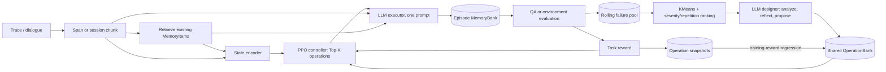

# MemSkill case study: learning how to write memory, not learning a Claude skill

> **Evidence basis.** This audit examines [`ViktorAxelsen/MemSkill`](https://github.com/ViktorAxelsen/MemSkill) at immutable commit [`9907c35f8cc71684d06a1f00e0b9c5c4a7b12c4c`](https://github.com/ViktorAxelsen/MemSkill/tree/9907c35f8cc71684d06a1f00e0b9c5c4a7b12c4c) (2026-05-24) and paper [arXiv:2602.02474v1](https://arxiv.org/abs/2602.02474v1). Claims below are classified as **implemented**, **paper/repository claim**, or **not demonstrated by the pinned artifact**. The audit did not call paid models or use credentials.

## Executive verdict

MemSkill is a substantial research prototype for a narrow and useful idea: represent **memory-write policies** as natural-language operations, learn a controller that composes those operations, and periodically rewrite the operation bank from supervised failures. The pinned code implements that loop end to end: span processing, retrieval, Top-K operation selection, one-pass LLM execution, downstream reward, PPO updates, hard-case clustering, LLM-authored operation changes, exploration bias, snapshots, rollback, and checkpoint resume.

It is not a general self-improving agent and its “skills” are not Claude Code procedural skills. They are prompts that tell an executor what facts to insert or how to update memory. Raw remembered content is stored separately in an episode-specific `MemoryBank`; the trainable controller is separate again. This distinction is explicit in the repository’s own [overview](https://github.com/ViktorAxelsen/MemSkill/blob/9907c35f8cc71684d06a1f00e0b9c5c4a7b12c4c/README.md#L32-L46) and is the most important boundary for Claude Self-Improvement.

The strongest design lesson is the **candidate → representative failures → proposed policy change → trial → rollback** loop. The strongest warning is that MemSkill promotes and rolls back against repeatedly sampled **training reward**, not an independent validation gate. `val_data` is constructed but never used after splitting. It therefore demonstrates online adaptation, not evidence that autonomous mutations are safe, durable, or generally better. Its LLM-generated operation text is only lightly schema-checked, its action constraints are advisory at execution time, and its hard-case/checkpoint state can retain complete raw memories and reference answers.

**Recommendation for Claude Self-Improvement:** adopt the failure-mining and explicit candidate lifecycle; adapt operation-bank snapshots into typed, provenance-bearing skill proposals evaluated on held-out tests; reject automatic direct mutation, reward-only promotion, transcript retention, and conflation of memory-operation meta-skills with user-facing procedural skills.

## What was inspected

The audit traced the complete source tree, repository history, run scripts, paper, and checked-in artifacts:

- runtime entry point and dataset splits: [`main.py`](https://github.com/ViktorAxelsen/MemSkill/blob/9907c35f8cc71684d06a1f00e0b9c5c4a7b12c4c/main.py);
- controller and PPO objective: [`src/controller.py`](https://github.com/ViktorAxelsen/MemSkill/blob/9907c35f8cc71684d06a1f00e0b9c5c4a7b12c4c/src/controller.py);
- memory store and retrieval: [`src/memory_bank.py`](https://github.com/ViktorAxelsen/MemSkill/blob/9907c35f8cc71684d06a1f00e0b9c5c4a7b12c4c/src/memory_bank.py);
- operation representation and lifecycle: [`src/operation_bank.py`](https://github.com/ViktorAxelsen/MemSkill/blob/9907c35f8cc71684d06a1f00e0b9c5c4a7b12c4c/src/operation_bank.py);
- executor and mutation application: [`src/executor.py`](https://github.com/ViktorAxelsen/MemSkill/blob/9907c35f8cc71684d06a1f00e0b9c5c4a7b12c4c/src/executor.py);
- hard-case mining, evolution, and snapshots: [`src/designer.py`](https://github.com/ViktorAxelsen/MemSkill/blob/9907c35f8cc71684d06a1f00e0b9c5c4a7b12c4c/src/designer.py);
- orchestration, reward, rollback, and resume: [`src/trainer.py`](https://github.com/ViktorAxelsen/MemSkill/blob/9907c35f8cc71684d06a1f00e0b9c5c4a7b12c4c/src/trainer.py);
- processors and evaluators for LoCoMo, LongMemEval, HotpotQA, and ALFWorld;
- shell workflows, requirements, committed skill examples, license, history, tests, and CI reality;
- paper-facing performance, transfer, ablation, and safety claims.

The pinned repository has 33 commits and is overwhelmingly authored under one identity in Git history. It contains no committed test files, no repository-owned CI workflow, no checkpoint, no result JSON, and no benchmark dataset beyond a LongMemEval index split. The 16 Markdown files under `skills/` are inspectable examples, not runtime inputs: no source reference to those directories exists.

## Three different things called “memory” or “skill”

Conflating these layers would lead Claude Self-Improvement in the wrong direction.

| Layer | MemSkill representation | Lifecycle | Closest Claude Self-Improvement analogue |
| --- | --- | --- | --- |
| **Memory-operation meta-skill** | `Operation{name, description, instruction_template, update_type, meta_info, embedding}` | Seeded, selected, refined/added by designer, snapshotted in checkpoint | A policy or reviewer rubric about **how to capture knowledge**, not a Claude skill artifact |
| **Selection policy** | PPO controller weights scoring state/operation pairs | Learned from downstream QA or task reward | A routing/ranking model; outside the initial deterministic `claude-si` vertical slice |
| **Raw remembered content** | `MemoryItem{content, embeddings, metadata, histories}` | Insert/update/delete/retrieve within an episode; optionally cached for evaluation | Candidate evidence or Claude memory content, but without MemSkill’s privacy and authorization gaps |
| **Procedural agent skill** | Not implemented as an executable procedure with tools, triggers, tests, or packaging | N/A | `SKILL.md` procedure installed for Claude Code |

The seed operation bank is four human-authored prompts—insert, update, delete, and noop—defined in [`prompts/operation_templates.py`](https://github.com/ViktorAxelsen/MemSkill/blob/9907c35f8cc71684d06a1f00e0b9c5c4a7b12c4c/prompts/operation_templates.py#L5-L139). An evolved operation such as “capture temporal context” remains an instruction to produce memory mutations. It cannot run commands, declare prerequisites, validate a workflow, or package references. The checked-in example makes this explicit: [`capture_temporal_context.md`](https://github.com/ViktorAxelsen/MemSkill/blob/9907c35f8cc71684d06a1f00e0b9c5c4a7b12c4c/skills/conversational_skills/capture_temporal_context.md) ends with “Action type: INSERT only.”

## Architecture and actual dataflow

### 1. Trace-specific memory construction

Each training episode starts with an empty memory bank, not a durable cross-user store ([`trainer.py` lines 1642–1712](https://github.com/ViktorAxelsen/MemSkill/blob/9907c35f8cc71684d06a1f00e0b9c5c4a7b12c4c/src/trainer.py#L1642-L1712)). A processor splits a conversation or trajectory into turns, turn pairs, sessions, or fixed-token chunks. For each chunk:

1. retrieve relevant existing memories using state-encoder embeddings;
2. encode current chunk plus retrieved memory state;
3. score all current operations with the controller;
4. select Top-K operations;
5. concatenate the selected descriptions and instruction templates into one executor prompt;
6. parse one or more `INSERT`, `UPDATE`, `DELETE`, or `NOOP` blocks and mutate the memory bank.

The one-pass composition claim is real: [`Executor._build_executor_prompt`](https://github.com/ViktorAxelsen/MemSkill/blob/9907c35f8cc71684d06a1f00e0b9c5c4a7b12c4c/src/executor.py#L43-L105) puts all selected operations in one prompt, and [`execute_operation`](https://github.com/ViktorAxelsen/MemSkill/blob/9907c35f8cc71684d06a1f00e0b9c5c4a7b12c4c/src/executor.py#L107-L169) makes one call for that chunk. At evaluation, question embeddings retrieve memory via a separate retriever embedding ([`memory_bank.py` lines 226–290](https://github.com/ViktorAxelsen/MemSkill/blob/9907c35f8cc71684d06a1f00e0b9c5c4a7b12c4c/src/memory_bank.py#L226-L290)).

This is semantic Top-K retrieval and prompt composition, not hierarchical skill retrieval or dependency-aware composition. Every operation remains a controller candidate; there is no trigger language, namespace, scope, prerequisite graph, conflict resolution, or budget beyond maximum bank size and Top-K.

### 2. Reward and controller learning

For conversational tasks, the completed memory bank answers sampled QA items; F1 or an LLM judge becomes the delayed reward ([`trainer.py` lines 760–919](https://github.com/ViktorAxelsen/MemSkill/blob/9907c35f8cc71684d06a1f00e0b9c5c4a7b12c4c/src/trainer.py#L760-L919)). For ALFWorld, offline Batch A trajectories build memory and online Batch B environment success supplies reward ([`trainer.py` lines 1932–2177](https://github.com/ViktorAxelsen/MemSkill/blob/9907c35f8cc71684d06a1f00e0b9c5c4a7b12c4c/src/trainer.py#L1932-L2177)).

The controller is a dynamic-action-space actor-critic: it transforms state and operation embeddings, scores every pair, and supports ordered Top-K sampling ([`controller.py` lines 209–317](https://github.com/ViktorAxelsen/MemSkill/blob/9907c35f8cc71684d06a1f00e0b9c5c4a7b12c4c/src/controller.py#L209-L317)). PPO, GAE, clipping, minibatches, entropy, KL stopping, and a short new-operation probability bias are implemented. The operation bank’s sorted candidate order and per-step operation embeddings make a changing bank technically tractable.

### 3. Hard-case mining

A failed QA case stores the question, reference answer, prediction, score, retrieved memories and indices, a full serialized memory-bank snapshot, conversation/epoch metadata, and recurrence count ([`DesignerCase`](https://github.com/ViktorAxelsen/MemSkill/blob/9907c35f8cc71684d06a1f00e0b9c5c4a7b12c4c/src/designer.py#L27-L106)). `CaseCollector` deduplicates by query ID, increments recurrence, and bounds cases by an epoch window and pool size ([`designer.py` lines 109–229](https://github.com/ViktorAxelsen/MemSkill/blob/9907c35f8cc71684d06a1f00e0b9c5c4a7b12c4c/src/designer.py#L109-L229)).

Before an evolution call, the designer:

- filters failures and deduplicates normalized question text;
- embeds **question text only** (retrieved-memory embedding is commented out);
- applies deterministic KMeans (`random_state=42`, `n_init=10`);
- ranks within clusters by `(1 - score) * log1p(fail_count)`;
- takes a fixed number from each cluster and fills remaining capacity globally.

That implementation is visible in [`designer.py` lines 884–1028](https://github.com/ViktorAxelsen/MemSkill/blob/9907c35f8cc71684d06a1f00e0b9c5c4a7b12c4c/src/designer.py#L884-L1028). It is a sensible diversity heuristic, but differs from the paper equation, which states `(1 - reward) * failure_count`; code dampens repetition with `log1p`. “Representative” means semantically diverse questions plus severity ranking, not causal diagnosis of which memory operation caused a failure.

### 4. Skill creation, refinement, trial, and reuse

The designer gives an LLM the current operation descriptions, failed questions, expected answers, predictions, and up to 20 retrieved memories per case. It runs an analysis call, configurable reflection rounds, and a final structured refinement call ([`designer.py` lines 1043–1330](https://github.com/ViktorAxelsen/MemSkill/blob/9907c35f8cc71684d06a1f00e0b9c5c4a7b12c4c/src/designer.py#L1043-L1330)). Parsed changes can add an operation or refine an existing one.

Applied additions require a name, description, non-empty instruction template, and `insert` or `update` type; refinements require an existing name and non-empty changes ([`designer.py` lines 1483–1674](https://github.com/ViktorAxelsen/MemSkill/blob/9907c35f8cc71684d06a1f00e0b9c5c4a7b12c4c/src/designer.py#L1483-L1674)). The operation bank recomputes embeddings and biases controller exploration toward changed operations. A checkpoint serializes controller, optimizer, operation bank, RNG state, snapshots, failure pool, training logs, and W&B resume metadata ([`trainer.py` lines 1740–1848](https://github.com/ViktorAxelsen/MemSkill/blob/9907c35f8cc71684d06a1f00e0b9c5c4a7b12c4c/src/trainer.py#L1740-L1848)). Reuse across runs and datasets therefore happens by loading a checkpoint, not by loading the Markdown examples under `skills/`.

The bank has a default capacity of 20. At capacity, adding a skill deletes the used operation with lowest average reward, or the least-used operation if none has reward history ([`operation_bank.py` lines 205–259](https://github.com/ViktorAxelsen/MemSkill/blob/9907c35f8cc71684d06a1f00e0b9c5c4a7b12c4c/src/operation_bank.py#L205-L259)). This is lossy replacement, not deprecation with provenance or dependency checks.

## Claims versus the pinned artifact

| Claim | Evidence and boundary | Assessment |
| --- | --- | --- |
| Skills are selected, composed, and applied in one pass | Top-K controller and combined executor prompt are implemented. | **Implemented.** Composition is prompt concatenation, not a planned workflow. |
| The skill bank evolves from hard cases | Rolling failed-case pool, KMeans sampling, analysis/reflection/refinement calls, add/refine application. | **Implemented.** The clustering feature is question text only; “hard” is evaluator failure, not verified root cause. |
| Skills are reusable across datasets and base models | Operation bank and controller are checkpointed; eval scripts can change dataset/model. Paper reports LoCoMo→LongMemEval/HotpotQA and LLaMA→Qwen. | **Mechanism implemented; result not independently reproduced.** No pinned result artifact, environment lock, or immutable checkpoint manifest is in the repository. |
| Closed-loop updates improve both selector and skill bank | PPO and designer alternate; paper Table 2 reports lower LLM-judge scores without controller/designer. | **Plausible and ablated in paper, not established by repository alone.** No raw runs, multiple seeds, uncertainty, or statistical test are shipped. |
| Rollback prevents harmful operation updates | Snapshot manager compares cycle tail reward and can restore the best operation bank before another evolution. | **Partly implemented.** Selection uses training reward. Early-stop breaks before restoring the best bank, so the final checkpoint can contain the currently regressed bank despite the paper saying training “return[s] the best skill bank snapshot.” |
| Minimal reliance on human priors | Designer can add/refine prompts from data. | **Overstated.** Four handcrafted primitives, evaluator prompts, chunking, retrieval, reward metric, designer prompt/schema, capacity, Top-K, thresholds, and model choices encode extensive priors. |
| “Continually” or “continuously” evolving | Multiple bounded evolution cycles are implemented, with max evolves and patience. | **Bounded training-time evolution.** No deployed monitoring loop, concept-drift policy, online authorization, or long-lived service exists. |
| Inspectable and controllable skill bank | Operations serialize to readable dictionaries and checked-in examples are readable Markdown. | **Inspectable in principle, weakly controlled.** Runtime uses checkpoint state; example Markdown is disconnected; there is no review UI, approval state, signed artifact, or provenance chain. |
| Responsible memory inspection/removal | Paper impact statement recommends controls; `MemoryBank` has programmatic get/delete methods. | **Not a product control.** No user identity, authorization, retention policy, redaction, export/delete workflow, or audit interface is implemented. |
| Reproducible benchmark gains | Paper reports strongest average results and ablations. | **Not demonstrated by pinned repository.** Data and outputs are absent, models are expensive API services, dependencies are unpinned, and no exact executable artifact captures the paper environment. |

### The early-stop/best-bank discrepancy

The snapshot manager itself tracks a best serialized bank and the normal no-improvement path restores it ([`trainer.py` lines 1347–1404](https://github.com/ViktorAxelsen/MemSkill/blob/9907c35f8cc71684d06a1f00e0b9c5c4a7b12c4c/src/trainer.py#L1347-L1404)). However, the early-stop check occurs first. On patience exhaustion, the loop breaks at lines 1365–1383 without assigning `self.operation_bank` from `best_snapshot`. `main.py` then saves `trainer.save_checkpoint('final')` ([`main.py` lines 1071–1084](https://github.com/ViktorAxelsen/MemSkill/blob/9907c35f8cc71684d06a1f00e0b9c5c4a7b12c4c/main.py#L1071-L1084)). If the stopping cycle regressed, that final artifact contains the regressed current bank. This is exactly the kind of “rollback claimed, final state not verified” failure that Claude Self-Improvement’s mutation journal and post-write hash verification must prevent.

## Evaluation quality, leakage, and overfitting

### What is sound

- LoCoMo is split by complete sample, 6/2/2, preventing dialogue-level overlap in the normal path ([`main.py` lines 65–75](https://github.com/ViktorAxelsen/MemSkill/blob/9907c35f8cc71684d06a1f00e0b9c5c4a7b12c4c/main.py#L65-L75)).
- The checked-in LongMemEval split has 297 train, 98 validation, and 105 test indices; a deterministic audit found 500 unique indices and zero pairwise overlap.
- ALFWorld’s training protocol samples non-overlapping corpus and reward trajectories within task type; official seen/unseen files are separately evaluated.
- The paper distinguishes transfer settings and reports ablations for random selection, static primitives, and refine-only evolution.
- Formal evaluation can use all valid QA items, while training-only LoCoMo query subsampling is isolated behind an evaluator hook.

### Evidence limits

1. **Validation is dead data.** `main.py` creates `val_data` for LoCoMo, LongMemEval, and list-form ALFWorld, but only passes `train_data` to `trainer.train` and `test_data` to inference; no source consumes `val_data` after the split ([`main.py` lines 1041–1077](https://github.com/ViktorAxelsen/MemSkill/blob/9907c35f8cc71684d06a1f00e0b9c5c4a7b12c4c/main.py#L1041-L1077)).
2. **Promotion is in-sample.** The “best” operation bank is selected by mean reward over the last fraction of controller-training batches, sampled repeatedly from the training set ([`trainer.py` lines 1291–1357](https://github.com/ViktorAxelsen/MemSkill/blob/9907c35f8cc71684d06a1f00e0b9c5c4a7b12c4c/src/trainer.py#L1291-L1357)). There is no fixed canary suite or held-out promotion evaluation.
3. **Hard cases include answers.** The designer prompt includes expected answers and retrieved raw memories. That is valid supervised diagnosis, but generated templates can copy benchmark-specific entities or answer patterns. Validation rejects placeholders and missing fields, not case-specific literals, semantic leakage, or benchmark references.
4. **The same failures recur.** Deduplication increments `fail_count`, and failed best-snapshot cases may be reused on subsequent evolution attempts. This focuses optimization but increases adaptive overfitting to a small query set—especially LoCoMo’s six training conversations.
5. **Model-judge dependence is material.** Paper headline conclusions emphasize LLM-judge scores; the judge is another large model. The repository permits F1 or LLM judge but ships no judge outputs, calibration sample, inter-rater analysis, or robustness check.
6. **No uncertainty reporting.** Paper tables report point estimates. The pinned paper/repository provides no run seeds per result, confidence intervals, standard deviations, or significance tests. A deterministic KMeans seed does not make stochastic API inference, PPO, parallel episode scheduling, or environment rollouts deterministic.
7. **Transfer does not prove broad generalization.** The reported transfer settings are valuable stress tests, but they use a small set of related memory benchmarks, one document QA protocol, and one embodied environment. Hyperparameters differ at evaluation (for example, Top-K and chunk size), and the README itself recommends held-out tuning.

For Claude Self-Improvement, a candidate must not become durable merely because it fixes the examples that generated it. Promotion needs at least: generating failures, disjoint regression tests, invariant/safety tests, a baseline comparison, and explicit approval when human-authored behavior changes.

## Safety, privacy, and integrity audit

### Raw-content retention

`DesignerCase.to_dict()` serializes the reference answer, evidence, retrieved memories, and full `memory_bank_snapshot`; the rolling pool is then included in checkpoints. Yet the designer prompt uses only the question, answer, prediction, and retrieved memories—not the full snapshot. This means the artifact retains substantially more potentially sensitive content than evolution needs. Memory histories also preserve previous versions after an update. There is no TTL, encryption layer, field-level redaction, consent metadata, or sensitivity classifier.

This directly conflicts with Claude Self-Improvement’s requirement to keep minimal normalized evidence rather than transcripts. Store fingerprints and bounded references where possible; make raw evidence opt-in, encrypted, expiring, and excluded from portable skill artifacts.

### Prompt and mutation trust

Interaction text and remembered content are interpolated into the executor prompt as plain text. Designer hard cases similarly embed model outputs and memories. Neither boundary marks content as untrusted or defends against instructions embedded in a dialogue. The parser accepts any syntactically valid action from the LLM. Although the prompt says to use only action types supported by selected skills, [`_parse_response`](https://github.com/ViktorAxelsen/MemSkill/blob/9907c35f8cc71684d06a1f00e0b9c5c4a7b12c4c/src/executor.py#L171-L232) and [`apply_to_memory_bank`](https://github.com/ViktorAxelsen/MemSkill/blob/9907c35f8cc71684d06a1f00e0b9c5c4a7b12c4c/src/executor.py#L510-L644) never enforce that allowed-action set. A selected insert-only skill can therefore produce and apply a delete; the mismatch merely affects shaping reward later.

Designer validation is also syntactic. New operations are restricted to insert/update, but refinement passes arbitrary existing attributes through `OperationBank.update_operation`; an `update_type` change is not validated on refinement. There is no allowlisted diff, policy engine, dry-run sandbox, content linter, secret scanner, or human authorization.

### Credential and log exposure

Run scripts encourage API keys as command-line arguments, exposing them to process listings and shell history. More seriously, API exceptions print `client.api_key` in [`llm_utils.py` lines 130–137](https://github.com/ViktorAxelsen/MemSkill/blob/9907c35f8cc71684d06a1f00e0b9c5c4a7b12c4c/llm_utils.py#L130-L137). Designer logs include complete analysis and refinement responses, and training logs can include failure-derived feedback. These patterns must be **rejected**, not adapted, for Claude Self-Improvement.

### Deletion and auditability

A delete physically removes an array element; unlike update, it does not preserve tombstone content, actor, justification, or operation history. Snapshot rollback covers operation-bank versions, not individual raw-memory mutations. There is no idempotency key, write-ahead journal, authorization decision, observed hash, or reconciliation after partial failure. MemSkill’s checkpoint is useful experiment state, but it is not an auditable mutation ledger.

## Reproducibility and project maturity

| Area | Evidence at pinned commit | Consequence |
| --- | --- | --- |
| Source availability | Apache-2.0 source; 31 Python files parsed successfully | Code can be studied and adapted subject to dependency/data/model licenses. |
| Dependencies | 19 requirement entries, none pinned; no lockfile | Exact environment cannot be reconstructed; upstream model/library changes can alter behavior. |
| Data | Dataset download instructions and one index split; benchmark payloads absent | Benchmark execution requires external mutable assets and their licenses. |
| Models | Large API models, embedding downloads, optional vLLM, A6000 paper environment | Full replication is costly and credentials-dependent. |
| Artifacts | No committed checkpoints, result files, raw predictions, W&B export, artifact checksums, or model cards | Paper numbers cannot be traced to immutable run artifacts from this repository. |
| Tests | Zero committed test files; `unittest discover` imports the package rather than discovering a suite | Parser, rollback, resume, concurrency, split, and safety behavior lack regression protection. |
| CI | No checked-in workflow; commit checks observed through GitHub were Pages build/deploy, not software tests | A green repository badge/status does not establish runtime correctness. |
| Static checks | `compileall` and AST parsing passed all 31 Python files | Syntax is sound, but this is far below behavioral verification. |
| Runtime smoke | Not run end to end: local audit environment lacked PyTorch and full runs require model downloads, GPU/API service, datasets, and credentials | No benchmark claim is presented here as independently reproduced. |
| History | 33 commits; post-release fixes include parser robustness, resume, evaluation efficiency, and retriever support | Active iteration is a strength, but also indicates the paper-era path has changed and needs versioned results. |

The repository license is Apache-2.0 ([`LICENSE`](https://github.com/ViktorAxelsen/MemSkill/blob/9907c35f8cc71684d06a1f00e0b9c5c4a7b12c4c/LICENSE)), a favorable basis for source reuse. It does not grant rights to benchmark data, external model weights, API outputs, or all dependencies. The published Markdown skill examples have no separate license boundary and fall under the repository license, but they are documentation artifacts rather than the authoritative checkpoint state.

## Strengths worth preserving

1. **Correct conceptual separation.** Memory behavior, routing policy, and remembered content are distinct state objects.
2. **Downstream feedback.** Skills are judged by task utility, not only by whether an LLM thinks their prose looks good.
3. **Representative failure mining.** Bounded windows, recurrence counts, clustering, and severity ranking are better than reacting to the latest anecdote.
4. **Variable skill-bank controller.** Scoring operation embeddings avoids a fixed output head and permits bank growth/refinement.
5. **One-call composition.** Combining selected memory operations limits executor calls and allows complementary extraction behavior.
6. **Explicit failed-attempt feedback.** Designer prompts include prior unsuccessful changes, reducing blind repetition.
7. **Snapshot and resume state.** Operation versions, RNG state, optimizer, failure pool, and attempted changes survive interruption.
8. **Transfer-oriented evaluation.** Base-model, dataset, context-length, and seen/unseen transfer are the right questions even if current evidence is incomplete.

## Concrete implications for Claude Self-Improvement

### Adopt

| MemSkill pattern | Claude Self-Improvement use |
| --- | --- |
| Bounded failure pool with recurrence | Aggregate normalized candidate fingerprints across sessions; increase priority when the same verified workaround recurs. |
| Diversity-aware representative sampling | Cluster or bucket candidates by owning artifact, failure type, tool, and task—not just embedding similarity—before reviewer attention. |
| Two-stage analyze then propose | Keep diagnosis separate from a typed patch proposal. Require the proposal to cite bounded evidence and the exact owning artifact. |
| Search/refine before add | Preserve the project’s existing preference to patch the exact owner or umbrella skill before creating a new skill. |
| Candidate trial plus rollback | Install into a controlled staging root, run discovery/invocation/regression tests, journal observed hashes, and rollback as a new mutation. |
| Failed-attempt memory | Record why a proposal failed and its test evidence so later reviewers do not repeat it. |
| Separate mutable content and policy metadata | Keep Claude knowledge files authoritative; keep candidate/provenance/mutation state in the engine database. |

### Adapt before use

1. **Replace learned operation prompts with typed artifact classes.** A Claude candidate must distinguish fact, instruction, procedure, enforcement rule, support material, temporary state, and sensitive content. MemSkill’s insert/update type is too coarse.
2. **Replace automatic mutation with proposal state.** Designer output is untrusted input. Parse into a strict schema, reject unknown fields, diff against a base hash, lint content, scan secrets, and require authorization.
3. **Replace training-tail reward with gated evidence.** Use disjoint generation and regression evidence. Promotion should require deterministic tests where possible and a fixed baseline; stochastic judge scores are supporting evidence only.
4. **Make provenance first-class.** Every skill section or mutation needs candidate IDs, evidence fingerprints, actor, model/tool version, base/observed hashes, decision, test results, and supersession chain.
5. **Minimize evidence.** Do not serialize whole transcripts or memory banks by default. Retain only the bounded excerpt or verification reference required to audit the lesson.
6. **Make composition explicit.** Claude procedures need trigger conditions, prerequisites, steps, verification, failure handling, and references. Embedding Top-K can aid discovery later, but cannot be the only conflict/ownership mechanism.
7. **Use canary deployment.** A newly changed skill should have a provisional state and bounded exposure before broader use; rollback must restore the verified best artifact, not merely keep a pointer to it.
8. **Constrain evaluator adaptation.** Evaluation cases and scoring policy must not be editable by the same loop that optimizes candidates without a separate review boundary.

### Reject

- direct model-authored writes to durable Claude instructions or skills;
- promotion on the same examples that generated the proposal;
- full transcript/memory snapshots in portable checkpoints or skill directories;
- secrets in command-line arguments, cache keys, exceptions, or logs;
- advisory-only action permissions;
- destructive deletes without tombstones and journaled recovery;
- silent least-reward eviction of an existing skill;
- an LLM judge as the sole acceptance oracle;
- equating an operation prompt with a reusable procedural Claude skill;
- claims of “self-evolution” without a bounded authority model and a verified final state.

## Proposed design pattern for this project

MemSkill suggests a useful outer loop if rebuilt around Claude Self-Improvement’s trust model:

```mermaid
flowchart LR
    E[Verified failure or correction] --> C[Minimal typed candidate]
    C --> D[Deduplicate + assign owning artifact]
    D --> H[Hard-case pool with recurrence]
    H --> R[Representative candidate set]
    R --> A[Reviewer diagnosis]
    A --> P[Typed proposal against base hash]
    P --> G[Policy + secret + schema gates]
    G --> U[User approval]
    U --> T[Journaled staged mutation]
    T --> V[Held-out discovery, invocation, regression, safety tests]
    V -->|pass| M[Promote with provenance]
    V -->|fail| B[Rollback and record failed attempt]
```

This keeps MemSkill’s feedback discipline while preserving the project specification’s core ownership boundary: Claude reasons, `claude-si` enforces deterministic policy and mutation mechanics, and the user authorizes durable behavior changes.

## Audit checks performed

All checks were run against the detached pinned commit without modifying upstream tracked files:

- verified `HEAD = 9907c35f8cc71684d06a1f00e0b9c5c4a7b12c4c` and a clean tracked worktree;
- inventoried the complete Git tree, all 33 commits, branches, tags, authors, and GitHub check-run metadata;
- traced all 31 Python files, shell workflows, prompts, skill examples, dataset adapters, evaluators, and checkpoint paths;
- `python3 -m compileall -q .`: **pass**;
- AST parse of all 31 Python files: **pass**;
- LongMemEval split integrity: **297/98/105**, all unique, **zero overlap**, union **500**;
- committed tests: **0**; checked-in CI workflows: **0**;
- committed checkpoints: **0**; committed result JSON files: **0**;
- requirements: **19 direct entries, 0 exact pins, 0 version ranges**;
- `python3 -m unittest discover -v`: no usable suite; discovery failed while importing `src` because PyTorch was not installed in the audit environment;
- no model/API benchmark run was attempted because it would require external datasets, substantial model downloads or GPU/API services, and credentials.

## Bottom line

MemSkill provides credible source evidence for a sophisticated **memory-policy optimization loop**, and its failure mining plus snapshot feedback are valuable precedents. It does not provide a safe or validated design for autonomous Claude skill mutation. For Claude Self-Improvement, its role should be inspirational but bounded: learn from how it gathers recurrent failures and trials policy variants, while retaining this project’s typed classification, search-before-create ownership, minimal evidence, human approval, journaled filesystem mutation, deterministic smoke tests, and recoverable provenance as non-negotiable controls.
