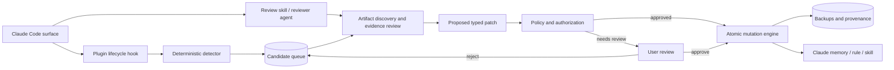

# Spec-0001: Initial system design

- **Status:** Proposed
- **Date:** 2026-07-28
- **Owners:** Claude Self-Improvement maintainers
- **Target repository:** `chocobot-farm/claude-self-improvement`
- **First release:** [Spec-0002: Phase 1 — Review-only vertical slice](0002-phase-1-review-only.md)

## Summary

Build a Claude Code plugin and companion local engine that convert verified corrections, debugging discoveries, and reusable workflows into durable knowledge.

The design deliberately separates:

- **detection**, which notices that a reusable lesson may exist;
- **review**, which interprets evidence and proposes a destination and diff;
- **authorization**, which decides whether a write is permitted;
- **mutation**, which performs a validated, backed-up, atomic change; and
- **curation**, which manages lifecycle after enough usage evidence exists.

The first release is review-only. Automatic updates, curation, Desktop Chat/Cowork, SSH, and devcontainers are later independent capabilities.

## Problem statement

Claude Code already supports persistent `CLAUDE.md` instructions, auto-memory, skills, hooks, agents, plugins, and MCP servers. Those mechanisms do not by themselves guarantee disciplined self-improvement.

A useful self-improvement system must answer five questions safely:

1. Was anything durable actually learned?
2. Is the lesson a fact, instruction, procedure, enforced rule, or temporary task result?
3. Does an existing artifact already own this knowledge?
4. Is the proposed change supported by evidence and safe to persist?
5. Can the exact mutation be audited and reversed?

Without this policy layer, automatic memory tends to accumulate stale task logs, duplicate skills, weak guesses, and contradictory instructions.

## First releasable vertical slice

> Claude completes a substantial task in one local Claude Code surface; a deterministic hook captures one candidate; the user reviews and approves an exact patch; the engine applies it reversibly; a fresh session in a different local surface finds and correctly uses the learned procedure.

This is the `v0.1` release boundary. A plugin skeleton, candidate database, mock-only classifier, or command that writes a sample skill is not a release.

## Verified platform seams

The following seams are documented by Anthropic as of the specification date. Implementation must pin and retest them against the minimum supported Claude Code version.

| Seam | Classification | Design use |
| --- | --- | --- |
| User plugins, skills, agents, and hooks | Verified public | Package the extension at user scope |
| Plugin hooks in `hooks/hooks.json` | Verified public | Capture lifecycle signals |
| `Stop`, `PostToolUse`, `PostToolUseFailure`, `PreCompact`, `SessionStart`, and related events | Verified public | Candidate evidence and reliability tests |
| Personal and project skills | Verified public | Durable procedures |
| `CLAUDE.md` and `.claude/rules/` loading | Verified public | Durable facts and scoped instructions |
| Claude-managed auto-memory | Verified public as a Claude feature; external mutation contract not verified | Read-only duplicate discovery in Phase 1; no direct engine writes |
| Shared Claude Code settings between CLI and VS Code | Verified public | One user-scope local install |
| Shared local settings/plugins between CLI and Desktop Code Local | Verified public | Third supported surface |
| Cowork/cloud skills sourced from account/project rather than Mac personal skills | Verified public limitation | Exclude from local first release |
| Devcontainer extension-host filesystem and home resolution | Must be verified per supported topology | Defer to Phase 4 |

Authoritative references:

- [Plugins](https://code.claude.com/docs/en/plugins)
- [Plugin reference](https://code.claude.com/docs/en/plugins-reference)
- [Hooks](https://code.claude.com/docs/en/hooks)
- [Skills](https://code.claude.com/docs/en/skills)
- [Memory](https://code.claude.com/docs/en/memory)
- [VS Code](https://code.claude.com/docs/en/vs-code)
- [Desktop Code tab](https://code.claude.com/docs/en/desktop)

## Supported surfaces and scope

### Initial support

- standalone Claude Code CLI on Anton's Mac;
- VS Code Claude Code extension in a local workspace on that Mac; and
- Claude Desktop Code tab using a Local environment on that Mac.

### Deferred

- ordinary Claude Desktop Chat;
- Cowork and Claude Code cloud sessions;
- Desktop or VS Code sessions over SSH;
- VS Code devcontainers; and
- synchronization between machines.

A deferred surface must not block or weaken the local release.

## Goals

1. Capture high-signal learning opportunities with low normal-turn overhead.
2. Route durable knowledge to the correct Claude mechanism.
3. Search and patch before creating duplicate artifacts.
4. Require evidence and verification before persistence.
5. Keep human-authored content review-gated.
6. Make every write atomic, attributable, validated, and reversible.
7. Preserve privacy by storing minimal normalized evidence rather than transcripts.
8. Work consistently across the three local Claude Code surfaces.
9. Fail without blocking Claude's normal work.
10. Provide deterministic tests and real packaged-artifact smoke tests.

## Non-goals

The initial architecture does not:

- replace Claude's model, session store, auto-memory implementation, or plugin manager;
- modify Claude authentication or credentials;
- persist every conversation or task result;
- make LLM judgment the sole authorization mechanism;
- silently rewrite human-authored instructions;
- enforce behavior by prompt instruction when a deterministic hook is required;
- provide a general-purpose personal knowledge graph;
- synchronize state to Anthropic, GitHub, or another cloud;
- support every Claude surface in `v0.1`; or
- guarantee compatibility with undocumented Claude internals.

## Core principles

### Evidence before persistence

A lesson must reference an observable correction, verified successful method, or explicit user request. Plausible model inference alone may create a review note but cannot authorize a durable fact.

### Correct destination

- Stable personal or environment fact → memory.
- Persistent project convention → project `CLAUDE.md` or scoped rule.
- Reusable multi-step procedure → skill.
- Deterministic lifecycle or safety requirement → hook proposal.
- Detailed supporting material → skill reference.
- Temporary task state or completed-work log → discard.

### Patch before create

The reviewer searches existing memories, rules, and skills first. It prefers, in order:

1. patch the exact owning artifact;
2. expand an existing umbrella artifact;
3. add a reference to an existing skill; then
4. propose a new artifact.

### Reversible by construction

A write is not successful until the old content is durably backed up, the new content is atomically installed, validation passes, and provenance records the transition.

### Deterministic authorization

An LLM may propose a classification or patch. Code decides whether the target, scope, ownership, content class, and mutation mode are allowed.

## Knowledge taxonomy

| Class | Examples | Destination | Initial authorization |
| --- | --- | --- | --- |
| User fact | shell preference, stable tool choice | user memory or user `CLAUDE.md` | Review |
| Project fact | build command, repository layout | project memory | Review |
| Project instruction | test gate, naming convention | project `CLAUDE.md` or rule | Review |
| Procedure | migration/debugging workflow | personal or project skill | Review |
| Enforcement | block secret reads, run formatter | hook | Proposal only in Phase 1 |
| Supporting detail | API reference, long troubleshooting notes | skill `references/` | Review |
| Temporary state | current TODO, one completed operation | none | Discard |
| Volatile identifier | commit SHA, PR number, run ID | none | Discard |
| Unverified inference | guessed cause or preference | candidate only | Never auto-persist |
| Sensitive content | credentials, tokens, private transcript | none | Redact and reject |

## Lean architecture



### Process boundaries

- Claude Code owns the session, model calls, plugin loading, tool execution, and hook invocation.
- The plugin owns skills, agents, hook declarations, and wrappers.
- `claude-si` owns candidate state, artifact indexing, policy evaluation, mutation, backup, and rollback.
- Claude's knowledge files remain the authoritative content Claude consumes.
- The state database is authoritative only for candidates, provenance, lifecycle metadata, and mutation history.
- The user owns approval of review-gated mutations.

No continuously running daemon is required for the first three phases. Hook and command invocations run the engine as bounded local processes using file locks and SQLite transactions.

## Proposed implementation technology

Use a small Go command-line engine compiled as a native executable, plus Markdown/JSON plugin assets.

Reasons:

- one native executable for hook startup;
- no dependency on macOS system Python or a user-visible Node installation;
- straightforward cross-compilation for later Linux devcontainers;
- standard-library support for hashing, JSON, filesystem safety, and process control; and
- a narrow CLI/JSON contract that is testable without Claude.

SQLite shall be embedded through a maintained driver, with WAL enabled only after concurrency tests prove cleanup and backup behavior. If the dependency or cross-compilation cost is unacceptable during Phase 1, an append-only JSONL state implementation may replace SQLite through a design amendment; both shall preserve the same logical contracts.

The plugin shall invoke the executable through a wrapper resolved from `${CLAUDE_PLUGIN_ROOT}`. Distribution shall package the correct macOS architecture artifact and verify its checksum. Source-tree execution is not accepted as the release smoke test.

## Proposed repository structure

```text
.
├── .claude-plugin/
│   └── plugin.json
├── agents/
│   └── learning-reviewer.md
├── hooks/
│   └── hooks.json
├── skills/
│   ├── self-improvement/
│   │   ├── SKILL.md
│   │   └── references/learning-policy.md
│   ├── review-learning/SKILL.md
│   ├── curate-learning/SKILL.md
│   └── rollback-learning/SKILL.md
├── bin/
│   └── claude-si-hook
├── cmd/
│   └── claude-si/main.go
├── internal/
│   ├── artifact/
│   ├── candidate/
│   ├── classify/
│   ├── policy/
│   ├── redact/
│   ├── state/
│   └── mutation/
├── tests/
│   ├── fixtures/hooks/
│   └── integration/
└── docs/specs/
```

Only `plugin.json` belongs inside `.claude-plugin/`; components remain at plugin root as required by Claude Code's plugin layout.

## Component design

### Plugin hook

The hook is a thin adapter. It:

1. reads one Claude hook event from stdin;
2. invokes `claude-si candidate capture` with bounded execution time;
3. emits no candidate body to the Claude conversation;
4. exits successfully even when capture fails; and
5. records local diagnostics without leaking transcript content.

The hook does not perform LLM review or mutate knowledge.

### Deterministic detector

The detector computes signals from bounded event metadata and, only when required, a bounded read of the referenced transcript. Transcript location is treated as sensitive input, not durable evidence storage.

Signals include:

- explicit user correction language;
- failed tool/command followed by verified success;
- skill use followed by workaround or correction;
- explicit remember/reuse request;
- task complexity threshold; and
- duplicate candidate fingerprint.

The detector outputs a normalized candidate envelope or no-op. It does not decide the final destination.

### Reviewer

The reviewer can be a Claude plugin agent or skill invoking the engine's discovery commands. It receives only the candidate and bounded evidence needed for judgment.

It must return a typed proposal:

```json
{
  "candidate_id": "...",
  "classification": "skill",
  "scope": "user",
  "target": "~/.claude/skills/example/SKILL.md",
  "action": "patch",
  "lesson": "...",
  "evidence": [{"kind": "verified_success", "ref": "..."}],
  "confidence": 0.0,
  "risk_flags": [],
  "base_hash": "sha256:...",
  "patch": "..."
}
```

The engine validates this schema and independently checks target, scope, hash, ownership, and forbidden content.

### Artifact discovery

Discovery indexes only supported Claude knowledge roots and the active trusted project. It records canonical path, type, scope, content hash, ownership, and lightweight search fields.

It must defend against:

- path traversal;
- symlink escape;
- case-normalization surprises;
- project root changes;
- stale indexes; and
- files changing between proposal and apply.

Search results are advisory. The current file is always re-read before mutation.

### Policy engine

The policy engine is the only component that returns an authorization result:

- `discard`;
- `candidate_only`;
- `needs_review`;
- `allowed_after_approval`; or
- `allowed_automatic` beginning in Phase 2.

Policy decisions include stable machine-readable reason codes. The plugin cannot bypass policy by changing prose.

### Mutation engine

The mutation engine accepts a typed, authorized proposal. It owns locking, stale checks, backup, atomic replacement, validation, provenance, and rollback.

It does not accept arbitrary shell commands. It supports bounded operations such as replacing one validated text artifact or creating one approved skill directory through a staged directory rename.

### State store

Logical entities:

- `candidates` — normalized lesson opportunities and status;
- `evidence_refs` — minimal references and fingerprints;
- `proposals` — typed classification and diff against a base hash;
- `artifacts` — indexed Claude knowledge and ownership;
- `mutations` — before/after hashes, backup, actor, and outcome;
- `usage_events` — Phase 3 metadata only;
- `curation_proposals` — Phase 3 consolidation/archive proposals; and
- `settings` — engine policy, never Claude credentials.

Candidate states:

```text
captured -> reviewing -> needs_review -> approved -> applying -> applied
    |           |             |             |           |
    +--------> discarded <----+----------> rejected     +--> failed
```

Every transition is transactional and idempotent. Replaying the same hook event cannot create duplicate candidates.

## Storage layout

Default local root on macOS:

```text
~/Library/Application Support/claude-self-improvement/
├── state.sqlite
├── backups/<mutation-id>/
├── archive/
├── logs/
└── locks/
```

The engine shall use the operating system's user data directory on future platforms rather than assuming the macOS path. Configuration may override this root for tests. Runtime state never lives inside the plugin cache because plugin updates may replace that directory.

Backup content inherits the sensitivity of the original artifact. User-only permissions are required. Backups must not be uploaded, synchronized, or committed automatically.

## Privacy and sensitive-data policy

### Never persist

- Claude, Anthropic, GitHub, or MCP credentials;
- `.env` values;
- complete transcript bodies;
- complete user prompts or assistant responses;
- private file contents unrelated to the learned artifact;
- authentication caches;
- account identifiers; or
- shell environment dumps.

### Minimal evidence

Persist only:

- session/event opaque identifier;
- timestamp;
- evidence kind;
- redacted normalized summary;
- source surface class;
- content fingerprint; and
- verification outcome.

Review may read bounded original evidence locally on demand. If unavailable, the candidate remains unverified rather than promoting the stored summary to fact.

### Redaction

Redaction runs before persistence and again before logs or diagnostics. Credential-shaped data causes rejection when safe redaction would destroy the meaning of the candidate.

## Concurrency and consistency

CLI, VS Code, and Desktop may run simultaneously. Therefore:

- candidate capture uses database transactions and unique event fingerprints;
- mutation uses one exclusive cross-process lock;
- proposals include a base content hash;
- apply rechecks canonical path and hash;
- stale proposals return to review;
- backups are complete before replacement;
- writes use same-directory temporary files and atomic rename; and
- post-write validation occurs before success is recorded.

The design does not rely on an in-memory singleton.

## Artifact ownership

Ownership values:

- **human:** created or explicitly claimed by the user;
- **agent:** created by this system with valid provenance;
- **mixed:** agent-created but externally modified, or jointly maintained;
- **unknown:** no reliable provenance.

Phase 1 requires review for all mutations. Phase 2 may automatically patch only unchanged `agent` artifacts under its eligibility policy. `human`, `mixed`, and `unknown` remain review-gated.

## Validation

Validators shall cover:

- UTF-8 and size limits;
- Markdown/frontmatter syntax;
- skill required fields and directory naming;
- relative reference existence;
- duplicate skill names and trigger collisions;
- forbidden executable or settings changes;
- path containment;
- policy-specific content rules; and
- plugin schema through the official Claude validator where available.

Validation warnings block automatic mutation.

## Commands and surface UX

The native engine exposes stable JSON output. Plugin skills provide natural-language UX.

Initial user-facing operations:

- status and health;
- list/show candidates;
- review and generate a proposal;
- approve/apply or reject;
- inspect mutation history; and
- rollback.

Phase 3 adds curator scan, proposal, archive, and restore.

Claude-generated prose is not parsed to determine whether an operation succeeded; the wrapper checks process exit status and JSON result fields.

## Failure model

| Failure | Required behavior |
| --- | --- |
| Hook timeout or crash | Do not block Claude; record local diagnostic |
| Store unavailable | Disable capture/mutation; preserve Claude operation |
| Reviewer unavailable | Keep candidate queued |
| Invalid proposal | Reject with reasons; no write |
| Stale target | Return to review; no force apply |
| Backup failure | Abort write |
| Write interruption | Preserve complete old or new artifact, never partial |
| Post-write validation failure | Restore previous artifact and mark failed |
| Rollback collision | Require review; do not overwrite current content |
| Unknown Claude version/schema | Fail closed for capture or mutation feature, not Claude itself |

## Version compatibility

The project shall maintain fixtures for each supported Claude Code hook schema and a small compatibility layer at the plugin boundary.

A new Claude Code version is supported only after:

1. plugin load verification;
2. hook fixture capture and schema comparison;
3. CLI, VS Code, and Desktop Local smoke tests; and
4. rollback verification.

Unsupported versions may run with self-improvement disabled and a diagnostic. They must not receive guessed writes.

## Distribution

Initial distribution is private:

- source hosted in `chocobot-farm/claude-self-improvement`;
- packaged plugin installed at user scope;
- native macOS artifact built by CI for supported architecture(s);
- checksums published with each private release; and
- plugin version and engine version reported by `claude-si doctor`.

A private Claude plugin marketplace may be added after local package installation is proven. Public distribution and marketplace submission are non-goals until the security model and privacy review are complete.

## Phase boundaries

| Concern | Phase 1 | Phase 2 | Phase 3 | Phase 4 |
| --- | --- | --- | --- | --- |
| Candidate detection | Required | Harden | Observe usage | Adapt per environment |
| Proposed diff | Required | Required | Consolidation proposals | Required |
| User approval | Every mutation | Risk/ownership dependent | Semantic curation | Environment dependent |
| Automatic writes | None | Narrow agent-owned patches | Metadata only | No broader by default |
| Archive | No | No | Reversible | Synchronization-aware |
| Local CLI/VS Code/Desktop Code | Required | Required | Required | Already stable |
| Devcontainer/SSH | No | No | No | Independent adapters |
| Desktop Chat/Cowork | No | No | No | Public-seam-dependent |

## Architecture risks

### Hook noise and cost

A model call after every `Stop` event would be expensive and intrusive. The deterministic detector must suppress ordinary turns before review.

### Prompt-based authorization

Claude may produce a convincing but unsafe proposal. Typed engine policy, not prose, owns authorization.

### Configuration corruption

Simultaneous surfaces can race. Hash preconditions, locks, backups, atomic writes, and packaged concurrency tests are release blockers.

### Knowledge pollution

Over-capture can make Claude worse. The taxonomy, discard rules, review-only first phase, and later usage-aware curation protect quality.

### Surface topology confusion

Desktop Local, cloud/Cowork, SSH, and devcontainers do not share one filesystem. Phase 4 treats each as a separate adapter rather than pretending configuration synchronization is automatic.

### Plugin update and runtime mismatch

The plugin and engine may update independently. Every invocation performs a protocol-version handshake. Incompatible versions disable mutation and report exact remediation.

## Decision log

1. **Plugin plus native engine, not prompt-only:** deterministic state, policy, locking, backup, and rollback require code.
2. **No daemon for initial releases:** bounded hook/command processes reduce lifecycle and security surface.
3. **Review-only first:** quality and safety evidence precede unattended writes.
4. **Claude files remain authoritative:** the engine does not replace Claude memory or skills with a private database.
5. **Go proposed for engine:** native startup and later cross-compilation outweigh a larger initial build step.
6. **No full transcript telemetry:** minimal evidence is sufficient and materially reduces privacy risk.
7. **Additional environments are independent adapters:** local value cannot be held hostage by cloud or container topology.

## Open implementation questions

These must be resolved during Phase 1 seam verification, not guessed:

1. Exact minimum Claude Code version exposing every required hook and plugin feature.
2. Stable hook fields available for deduplication and bounded evidence lookup.
3. Official plugin validation command and packaged plugin behavior in each surface.
4. Whether Desktop Local exposes the same executable PATH as CLI and VS Code.
5. Packaging format for Intel and Apple Silicon Macs.
6. Exact auto-memory discovery contract safe for supported versions. Direct external writes remain disabled unless Anthropic documents a supported mutation seam.
7. Whether SQLite or append-only JSONL produces the simpler interruption-safe first implementation.

Each answer must be captured in tests and, where it changes this design, in a specification amendment.

## Acceptance of this design

Spec-0001 is ready for implementation only when maintainers accept:

- the review-only `v0.1` boundary;
- the ownership and privacy model;
- the supported-surface matrix;
- the proposed engine/plugin split;
- the mutation and rollback invariants; and
- the explicit deferral of cloud, Chat, SSH, and devcontainer support.
